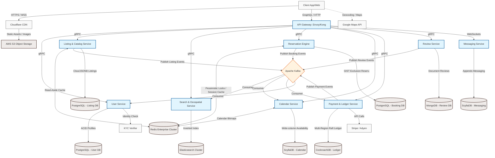
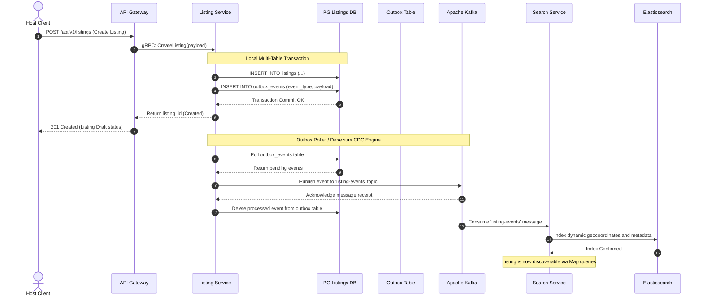
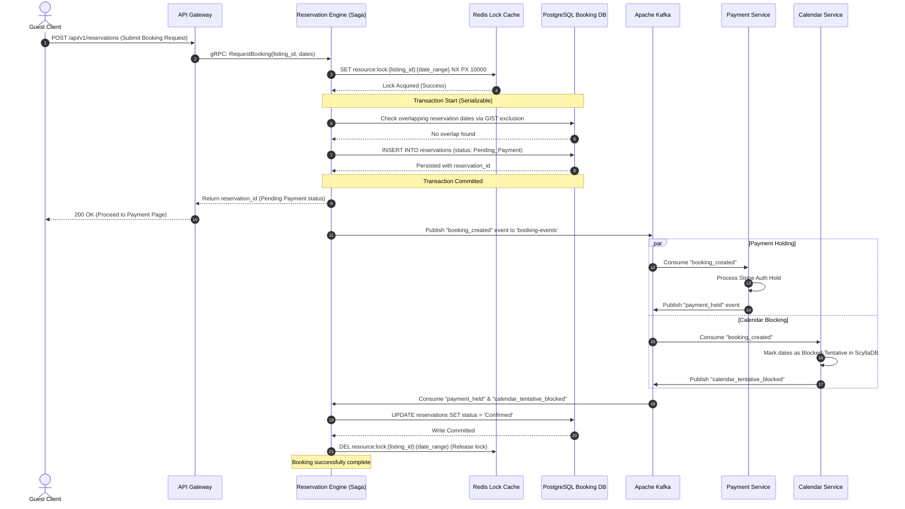

# System Design: Airbnb
## Executive Summary

This document presents a comprehensive, production-ready system architecture for **Airbnb**, a highly scalable, multi-region vacation rental and hospitality marketplace. Designed to support **15 million Daily Active Users (DAU)**, a peak throughput of **50,000 Requests Per Second (RPS)**, and over **5 Petabytes (5,000 TB) of transactional and operational data**, this architecture leverages an **Event-Driven Microservices** style.

The design utilizes specialized data systems tailored to distinct domain requirements: **PostgreSQL** with GIST exclusion constraints for conflict-free relational booking metadata, **ScyllaDB** for high-velocity calendar and messaging streams, **Elasticsearch** for sub-millisecond geo-bounding search indexing, and **CockroachDB** to guarantee strict serializable isolation for global payments. Asynchronous state synchronization is driven by **Apache Kafka**, while distributed concurrency control is enforced via a hybrid caching and locking layer leveraging **Redis Enterprise**.

---

## 1. Requirements

### 1.1 Functional Requirements

*   **Property Listing Management**: Hosts must be able to create, edit, and delete property listings complete with rich metadata (descriptions, amenities, house rules, custom pricing structures) and high-resolution media.
*   **Search & Discovery**: Guests must be able to search for available accommodations via real-time geographic queries (bounding-box and radius queries on maps) combined with complex filtering criteria (date ranges, guest count, price variance, and specific amenities).
*   **Reservation & Booking Engine**: Guests must be able to securely reserve properties. The system must prevent double-booking of any date interval for a given property, supporting both instant-booking and host-approval transaction flows.
*   **Payment Processing**: Supports safe global checkouts with credit cards and digital wallets, multi-currency conversion, secure escrow holding, and automated payout execution to hosts (minus platform service fees).
*   **Review & Rating System**: A double-blind, two-way review framework allowing guests and hosts to rate and review each other within a strict 14-day post-stay window. Reviews remain hidden until both parties submit or the window closes.
*   **Real-Time Messaging**: Direct in-app message exchanges between guests and hosts before, during, and after booking windows.

### 1.2 Non-Functional Requirements

| Requirement | Target Value | Rationale / Engineering Trade-off |
| :--- | :--- | :--- |
| **Availability** | `99.99%` (Four Nines) | Critical booking and search services must experience $\le$ 52.6 minutes of unscheduled downtime annually. Highly critical paths are decoupled using fallback flows. |
| **Latency** | `p99 < 250ms` | Maximizes guest conversion rates. Edge CDNs and in-memory caches serve high-traffic reads to meet strict latency budgets. |
| **Throughput** | `50,000 Peak RPS` | Must gracefully handle extreme seasonal traffic spikes and flash-marketing events without cascading cluster failures. |
| **Consistency** | `Hybrid Model` | **Strong consistency** is strictly enforced for bookings, payments, and calendar blocks. **Eventual consistency** ($\le 500\text{ms}$) is accepted for search indexing, reviews, and messaging. |

### 1.3 Scale Estimates

With **15,000,000 Daily Active Users (DAU)**, we assume a read-to-write ratio of **100:1** for search and listing interactions, and **10:1** for messaging.

#### A. QPS Calculations
*   **Daily Interactions**: Assume an average active user makes $60$ requests per day (including page scrolls, search adjustments, and heartbeats).
    $$\text{Total Daily Requests} = 15,000,000 \times 60 = 900,000,000\text{ requests/day}$$
*   **Average RPS**:
    $$\text{Average RPS} = \frac{900,000,000}{86,400\text{ seconds}} \approx 10,416\text{ RPS}$$
*   **Peak RPS**: Designed for a **$5\times$ surge factor**, yielding **$50,000$ Peak RPS**.

#### B. Storage & Bandwidth Calculations
*   **Listing Data Volume**: With $100,000,000$ listings globally:
    *   Metadata (structured SQL parameters): $5\text{ KB}$ per listing $\approx 500\text{ GB}$.
    *   Media (average 20 high-res photos per listing @ $2\text{ MB}$ each = $40\text{ MB}$ per listing):
        $$\text{Total Media Volume} = 100,000,000 \times 40\text{ MB} = 4,000\text{ TB} = 4\text{ PB}$$
        *(Offloaded entirely to Object Storage / CDN).*
*   **Messaging Storage**: Assume $5\%$ of DAU ($750,000$ users) send $10$ messages daily. Each message with metadata is $1\text{ KB}$.
    $$\text{Daily Message Storage} = 750,000 \times 10 \times 1\text{ KB} = 7.5\text{ GB/day}$$
    Over 5 years: $7.5\text{ GB/day} \times 1,825\text{ days} \approx 13.7\text{ TB}$.
*   **Transaction Logs & Calendars**: Custom pricing matrices and availability tables for $100\text{M}$ listings over a 365-day window. Each calendar cell is $100\text{ bytes}$.
    $$\text{Active Calendar Cells} = 100,000,000 \times 365 = 36.5\text{ Billion rows}$$
    $$\text{Active Calendar Storage} = 36.5\text{B} \times 100\text{ bytes} \approx 3.65\text{ TB (In-Memory / Wide-Column Store)}$$

### 1.4 Assumptions

*   High-resolution media (photos, videos) are processed asynchronously, stored in cloud-native object storage (e.g., AWS S3), and distributed globally via a CDN. Database tables store only deterministic, immutable media URLs.
*   Geospatial queries assume a bounding-box or circular radius boundary calculated dynamically on the guest client based on map drag/zoom actions.
*   System administrators and compliance workers access internal operations through dedicated, isolated back-office networks bypassing public API Gateways.

---

## 2. High-Level Architecture

### 2.1 Architecture Overview

The system uses an **Event-Driven Microservices Architecture** configured with **CQRS (Command Query Responsibility Segregation)** to isolate high-throughput search operations from transactional listing writes. 

*   **Write Pathway (Command)**: Hosts update listing data through the Listing Service, which persists changes to PostgreSQL. These writes trigger a transaction log entry via the **Transactional Outbox Pattern**, pushing state changes to an **Apache Kafka** cluster.
*   **Read Pathway (Query)**: The Search & Geospatial Service consumes listing changes from Kafka, transforming and indexing them in **Elasticsearch**. Guests search exclusively against this read-optimized search cluster.
*   **Booking Pathway (Saga Orchestration)**: Booking and payment sequences are managed by a centralized Saga state machine hosted in the **Reservation & Booking Engine**. This engine uses a combination of Redis-based pessimistic locking and relational database isolation levels to maintain transactional integrity across boundary lines without distributed 2PC (Two-Phase Commit) blockages.

### 2.2 Architecture Diagram



### 2.3 Technology Stack

| Component | Technology | Justification |
| :--- | :--- | :--- |
| **Edge Cache & CDN** | Cloudflare Enterprise | Advanced on-the-fly image optimization, global static asset caching, and strong Layer-7 DDoS shielding. |
| **API Gateway** | Envoy Proxy | High-performance, low-memory foot-print proxy supporting Native gRPC, HTTP/2 multiplexing, and dynamic route discovery. |
| **Message Broker** | Apache Kafka | Ordered partitioning, high-throughput durability log, and replayable events essential for event-driven CQRS. |
| **Distributed Cache** | Redis Enterprise | Sub-millisecond latency. Active-Active multi-region replication supports distributed lock orchestration. |
| **Primary Transactions** | PostgreSQL | Strong ACID properties. Robust support for custom indexing (GIST) to resolve complex temporal reservation boundaries natively. |
| **Global Ledger** | CockroachDB | Distributed SQL engine running Raft consensus. Guarantees serializable isolation profiles across multiple active geographic cloud regions. |
| **NoSQL / Wide-Column** | ScyllaDB | C++ rewrite of Cassandra. Delivers maximum append throughput and ultra-low latency for chat logs and daily calendar grids. |
| **Geospatial Engine** | Elasticsearch | Built-in support for Bounding Box and Geo-Distance indexing, allowing complex faceted filtering at scale. |
| **Document Store** | MongoDB | Highly flexible document-oriented schema perfectly matching write-once double-blind host/guest reviews. |
| **Compute Engine** | AWS EKS (Kubernetes) | Seamless scaling, rolling deployments, and container isolation across three redundant availability zones. |

---

## 3. Component Details

### 3.1 User Service
*   **Description**: Core domain engine managing identity, host metrics, profiles, and compliance checks.
*   **Responsibilities**: Profile operations, KYC (Know Your Customer) verifications, host badge distribution, and authentication state transitions.
*   **Technology Choice**: **Go** microservice paired with a relational **PostgreSQL** backend.
*   **Scaling Strategy**: Horizontal replication of Go stateless containers driven by Kubernetes HPA (Horizontal Pod Autoscaler). Read workloads utilize local regional replicas.

### 3.2 Listing & Catalog Service
*   **Description**: System of record for all marketplace inventory entries.
*   **Responsibilities**: Manages listing descriptions, amenities, custom pricing profiles, and validation of uploaded media references.
*   **Technology Choice**: **Java / Spring Boot** utilizing **PostgreSQL with JSONB** columns.
*   **Scaling Strategy**: Citus database extension shards listings by `host_id`, localizing inventory management tasks on a per-host basis.

### 3.3 Search & Geospatial Service
*   **Description**: Read-heavy discovery query engine.
*   **Responsibilities**: Map queries, distance filtering, search auto-complete, and category ranking.
*   **Technology Choice**: **Python / FastAPI** service backed by **Elasticsearch**.
*   **Scaling Strategy**: Replicated read-only nodes distributed across geographic zones. Index routing keys are mapped to country or state/region identifiers to avoid cross-cluster query scatter.

### 3.4 Reservation & Booking Engine
*   **Description**: State orchestrator for reservation state machines.
*   **Responsibilities**: Validates date ranges, acquires locking tokens, executes booking state transitions, and guarantees zero double-bookings.
*   **Technology Choice**: **Go** service paired with a specialized transactional **PostgreSQL** schema.
*   **Scaling Strategy**: Database is partitioned horizontally by hash of the `listing_id` to distribute lock contention overhead uniformly.

### 3.5 Calendar & Availability Service
*   **Description**: Grid tracking service monitoring day-by-day availability and price overrides.
*   **Responsibilities**: Tracks reservation blocks, host blackouts, dynamic seasonal rates, and availability checking.
*   **Technology Choice**: **ScyllaDB** (wide-column matrix).
*   **Scaling Strategy**: Partitions are structured strictly around `listing_id` to guarantee that all calendar matrices for any given property are stored sequentially on disk, enabling sub-millisecond range reads.

### 3.6 Payment & Ledger Service
*   **Description**: The platform financial core, tracking funds flow.
*   **Responsibilities**: Manages guest authorization holds, escrow custody tracking, host payouts, and platform fee ledger entries.
*   **Technology Choice**: **Java** microservice backed by **CockroachDB**.
*   **Scaling Strategy**: Regional row-level data pinning in CockroachDB isolates transaction processing to local regional nodes while retaining global serializability.

### 3.7 Review & Rating Service
*   **Description**: Manages mutual double-blind evaluations.
*   **Responsibilities**: Stores pending hidden reviews, monitors expiration timers, and publishes visible aggregated feedback.
*   **Technology Choice**: **Node.js** with **MongoDB**.
*   **Scaling Strategy**: Aggregated metrics are calculated asynchronously and cached in Redis. The document collection is horizontally sharded by target user/listing IDs.

### 3.8 Messaging Service
*   **Description**: Real-time chat engine between users.
*   **Responsibilities**: Message routing, WebSocket connection state preservation, and unread indicator tracking.
*   **Technology Choice**: **Elixir / Phoenix Framework** using **ScyllaDB** storage.
*   **Scaling Strategy**: Leverages the Erlang BEAM virtual machine to maintain millions of long-lived WebSocket connections concurrently.

---

## 4. Data Flow

### 4.1 Primary Data Flows

#### A. CQRS Search Sync Flow
This sequence shows how listings are created and asynchronously synced to the Elasticsearch read cluster.



#### B. Booking & Reservation Saga Flow
This sequence details the reservation checkout sequence, highlighting how the Saga orchestrator processes lock acquisition, payment hold, and calendar date blocking.



### 4.2 Key Flows Explained

1.  **Search & Discovery Mapping**: When guests drag their map, the client captures the bounding-box geographic boundaries (top-left latitude/longitude, bottom-right latitude/longitude). This bounding box is passed to the API Gateway. The Search & Geospatial Service processes this request by executing a geo-bounding-box search index query against Elasticsearch, filtering by availability dates (excluding listings with dates registered in the blocked index arrays).
2.  **Double-Booking Elimination**: Concurrency safety relies on a multi-stage lock pipeline:
    *   *First Stage*: An active key allocation in a Redis cluster using a distributed lock lock-map ensures that two identical booking requests targeting the exact same listing date range are blocked in memory before hitting any persistent database layers.
    *   *Second Stage*: A transaction in PostgreSQL checks a native PostgreSQL table interval range for overlaps. An exclusion index guarantees that if a concurrent transaction manages to bypass the Redis lock (e.g., during a node failure or network split), the database layer blocks the insert, maintaining consistency.
3.  **Real-Time Message Distribution**: When a user posts a message, the client establishes an active WebSocket channel to the Messaging Service. The service persists the payload to ScyllaDB for history logging, then checks Redis to see if the recipient has an active open WebSocket connection. If active, the message is routed down that connection. If inactive, an event is pushed to Kafka to trigger a push notification through Apple Push Notification Service (APNS) or Firebase Cloud Messaging (FCM).

---

## 5. Database Design

### 5.1 User Service Database (PostgreSQL)

```sql
-- Core user entity table
CREATE TABLE users (
    id UUID PRIMARY KEY DEFAULT gen_random_uuid(),
    email VARCHAR(255) UNIQUE NOT NULL,
    password_hash VARCHAR(255) NOT NULL,
    first_name VARCHAR(100) NOT NULL,
    last_name VARCHAR(100) NOT NULL,
    phone VARCHAR(30),
    is_host BOOLEAN DEFAULT FALSE,
    verification_status VARCHAR(50) DEFAULT 'unverified',
    created_at TIMESTAMP WITH TIME ZONE DEFAULT NOW() NOT NULL,
    updated_at TIMESTAMP WITH TIME ZONE DEFAULT NOW() NOT NULL
);

-- Extended user metadata profile
CREATE TABLE user_profiles (
    user_id UUID PRIMARY KEY REFERENCES users(id) ON DELETE CASCADE,
    bio TEXT,
    languages TEXT[],
    location VARCHAR(255),
    avatar_url VARCHAR(512),
    preferences JSONB DEFAULT '{}' NOT NULL
);

-- Core indexes for performance
CREATE UNIQUE INDEX idx_users_email ON users(email);
CREATE INDEX idx_users_verification_status ON users(verification_status);
CREATE INDEX idx_user_profiles_preferences_gin ON user_profiles USING gin (preferences);
```

*   **Sharding / Scaling Strategy**: Scaled primarily via global read-replicas. If users scale past 100M, dynamic horizontal range sharding is executed over the User ID hash.

---

### 5.2 Listing & Catalog Database (PostgreSQL)

```sql
-- Main listing structure table
CREATE TABLE listings (
    id UUID PRIMARY KEY DEFAULT gen_random_uuid(),
    host_id UUID NOT NULL,
    title VARCHAR(255) NOT NULL,
    description TEXT NOT NULL,
    latitude NUMERIC(9,6) NOT NULL,
    longitude NUMERIC(9,6) NOT NULL,
    base_price NUMERIC(12,2) NOT NULL,
    currency VARCHAR(3) DEFAULT 'USD' NOT NULL,
    amenities JSONB DEFAULT '[]' NOT NULL,
    rules JSONB DEFAULT '{}' NOT NULL,
    status VARCHAR(50) DEFAULT 'draft' NOT NULL,
    created_at TIMESTAMP WITH TIME ZONE DEFAULT NOW() NOT NULL,
    updated_at TIMESTAMP WITH TIME ZONE DEFAULT NOW() NOT NULL
);

-- Listing image/media store
CREATE TABLE listing_media (
    id UUID PRIMARY KEY DEFAULT gen_random_uuid(),
    listing_id UUID REFERENCES listings(id) ON DELETE CASCADE NOT NULL,
    media_url VARCHAR(512) NOT NULL,
    display_order INT NOT NULL,
    is_cover BOOLEAN DEFAULT FALSE NOT NULL,
    created_at TIMESTAMP WITH TIME ZONE DEFAULT NOW() NOT NULL
);

-- Indexes optimized for geographic sorting & catalog searches
CREATE INDEX idx_listings_host_id ON listings(host_id);
CREATE INDEX idx_listings_geo ON listings(latitude, longitude);
CREATE INDEX idx_listings_amenities_gin ON listings USING gin (amenities);
CREATE INDEX idx_listing_media_listing_id ON listing_media(listing_id);
```

*   **Sharding / Scaling Strategy**: Partitioned horizontally using PostgreSQL schemas managed by Citus. Sharding is done using a hash of the `host_id` parameter to distribute multi-listing updates across physical databases.

---

### 5.3 Reservation & Booking Database (PostgreSQL)

```sql
-- Enable btree_gist extension to support overlapping exclusion checks
CREATE EXTENSION IF NOT EXISTS btree_gist;

-- Main bookings execution table
CREATE TABLE reservations (
    id UUID PRIMARY KEY DEFAULT gen_random_uuid(),
    listing_id UUID NOT NULL,
    guest_id UUID NOT NULL,
    check_in DATE NOT NULL,
    check_out DATE NOT NULL,
    total_price NUMERIC(12,2) NOT NULL,
    currency VARCHAR(3) NOT NULL,
    status VARCHAR(50) NOT NULL,
    created_at TIMESTAMP WITH TIME ZONE DEFAULT NOW() NOT NULL,
    updated_at TIMESTAMP WITH TIME ZONE DEFAULT NOW() NOT NULL,
    
    -- Absolute GIST exclusion guard protecting system-wide against double-bookings
    CONSTRAINT no_overlapping_bookings EXCLUDE USING gist (
        listing_id WITH =,
        daterange(check_in, check_out, '[]') WITH &&
    )
);

-- Event log for state machines tracking transaction sagas
CREATE TABLE reservation_events_log (
    event_id UUID PRIMARY KEY DEFAULT gen_random_uuid(),
    reservation_id UUID REFERENCES reservations(id) ON DELETE CASCADE NOT NULL,
    state_transition VARCHAR(100) NOT NULL,
    payload JSONB NOT NULL,
    created_at TIMESTAMP WITH TIME ZONE DEFAULT NOW() NOT NULL
);

CREATE INDEX idx_reservations_guest ON reservations(guest_id);
CREATE INDEX idx_reservations_status ON reservations(status);
```

> [!IMPORTANT]
> The `no_overlapping_bookings` constraint uses a GIST exclusion index. This forces the engine to block any insert where `listing_id` matches and the check-in/check-out date range (`daterange`) overlaps (`&&`) with an existing row, preventing race conditions.

---

### 5.4 Calendar & Availability Database (ScyllaDB)

```sql
-- Wide-column row tracking individual calendar days
CREATE TABLE listing_calendar (
    listing_id uuid,
    date date,
    available boolean,
    custom_price decimal,
    reservation_id uuid,
    PRIMARY KEY (listing_id, date)
) WITH CLUSTERING ORDER BY (date ASC);
```

*   **Partitioning Strategy**: Partitioned by `listing_id`. This groups all availability slots for a specific listing sequentially on disk within a single ScyllaDB node, enabling range queries (e.g., fetching a 30-day calendar range) with sub-millisecond seek times.

---

### 5.5 Payment & Ledger Database (CockroachDB)

```sql
-- Multi-region financial transactions tracker
CREATE TABLE payment_transactions (
    id UUID PRIMARY KEY DEFAULT gen_random_uuid(),
    booking_id UUID UNIQUE NOT NULL,
    payer_id UUID NOT NULL,
    payee_id UUID NOT NULL,
    amount DECIMAL(15,4) NOT NULL,
    currency VARCHAR(3) NOT NULL,
    status VARCHAR(50) NOT NULL,
    transaction_type VARCHAR(50) NOT NULL,
    gateway_ref VARCHAR(255),
    created_at TIMESTAMP WITH TIME ZONE DEFAULT NOW() NOT NULL
);

-- Core double-entry ledger database for financial tracking
CREATE TABLE ledger_entries (
    id UUID PRIMARY KEY DEFAULT gen_random_uuid(),
    transaction_id UUID REFERENCES payment_transactions(id) NOT NULL,
    account_id VARCHAR(100) NOT NULL,
    type VARCHAR(10) NOT NULL CHECK (type IN ('DEBIT', 'CREDIT')),
    amount DECIMAL(15,4) NOT NULL,
    created_at TIMESTAMP WITH TIME ZONE DEFAULT NOW() NOT NULL
);

CREATE INDEX idx_pay_txn_booking ON payment_transactions(booking_id);
CREATE INDEX idx_pay_txn_payee ON payment_transactions(payee_id);
CREATE INDEX idx_ledger_account ON ledger_entries(account_id);
```

*   **Partitioning Strategy**: Geographically partitioned by row-level attributes using CockroachDB's `REGIONAL BY ROW` configuration. This stores data on physical servers closest to the region of origin, reducing global Raft WAN latency while maintaining serializable consistency.

---

### 5.6 Review & Rating Database (MongoDB)

```javascript
// Sample JSON Document saved in MongoDB "reviews" collection
{
  "_id": ObjectId("65678abc1234567890def123"),
  "reservation_id": "123e4567-e89b-12d3-a456-426614174000",
  "reviewer_id": "9b1deb4d-3b7d-4bad-9bdd-2b0d7b3dcb6d",
  "reviewer_role": "guest", // or "host"
  "target_id": "aa1deb4d-3b7d-4bad-9bdd-2b0d7b3dcb6f", // user_id or listing_id
  "rating": 5,
  "comments": "Absolutely perfect flat, incredibly communicative host!",
  "is_published": false, // remains false until both review, or 14-day window expires
  "created_at": ISODate("2023-11-28T14:32:00.000Z")
}
```

*   **Indexing Configuration**:
    *   `db.reviews.createIndex({ "reservation_id": 1, "reviewer_role": 1 }, { unique: true })`
    *   `db.reviews.createIndex({ "target_id": 1, "is_published": 1, "created_at": -1 })`
*   **Partitioning Strategy**: Horizontal sharding using the `target_id` hash value. This balances aggregated listing/user review lookups evenly across active MongoDB shards.

---

### 5.7 Messaging Database (ScyllaDB)

```sql
-- Appends sequential chat records natively
CREATE TABLE messages (
    room_id uuid,
    message_id timeuuid,
    sender_id uuid,
    payload text,
    created_at timestamp,
    PRIMARY KEY (room_id, message_id)
) WITH CLUSTERING ORDER BY (message_id DESC);
```

*   **Partitioning Strategy**: Partitioned by `room_id`. Using a `timeuuid` as the clustering key sorted in descending order allows the chat UI to paginate back through message history using fast slice queries on a single partition block.

---

## 6. API Design

### 6.1 Public REST / GraphQL API Endpoints

While internal microservices communicate via gRPC, public-facing endpoints are served via a unified GraphQL gateway or a REST-compatible layer.

| Method | Endpoint | Description | Request Body / Parameters | Response Code & Output |
| :--- | :--- | :--- | :--- | :--- |
| **POST** | `/api/v1/users` | Register user accounts. | `{"email": "string", "password_hash": "...", "first_name": "...", "last_name": "...", "role": "guest"}` | `201 Created` <br> `{"user_id": "uuid", "status": "pending_verification"}` |
| **GET** | `/api/v1/listings/{id}` | Read listing parameters. | *None* | `200 OK` <br> `{"id": "uuid", "title": "Cozy Cabin", "base_price": 125.00}` |
| **POST** | `/api/v1/search` | Dynamic map search. | `{"geo_bounding_box": {"top_left": {"lat": 40.8, "lon": -74.1}, "bottom_right": {"lat": 40.6, "lon": -73.9}}, "checkin_date": "2023-12-01", "checkout_date": "2023-12-08"}` | `200 OK` <br> `{"results": [{"listing_id": "uuid", "title": "..."}], "total_count": 45}` |
| **POST** | `/api/v1/reservations` | Initiate reservation. | `{"listing_id": "uuid", "guest_id": "uuid", "checkin_date": "2023-12-01", "checkout_date": "2023-12-08"}` | `200 OK` <br> `{"reservation_id": "uuid", "status": "reserved_pending_payment"}` |
| **GET** | `/api/v1/calendars/{id}` | Fetch calendar grids. | *Query Param*: `?year=2023` | `200 OK` <br> `{"listing_id": "uuid", "days": [{"date": "2023-12-01", "available": false}]}` |
| **POST** | `/api/v1/payments/checkout` | Payment processing. | `{"reservation_id": "uuid", "payment_method_id": "pm_123", "amount": 840.00}` | `200 OK` <br> `{"payment_id": "uuid", "status": "held_in_escrow"}` |
| **POST** | `/api/v1/reviews` | Submit blind evaluation. | `{"reservation_id": "uuid", "reviewer_id": "uuid", "target_id": "uuid", "rating": 5, "comments": "..."}` | `201 Created` <br> `{"review_id": "uuid", "status": "hidden"}` |

---

## 7. Caching Strategy

```
                          [CDN (Cloudflare)] Edge
                                     │
                        (Miss)       ▼
                       [API Gateway (Envoy)]
                                     │
                                     ▼
                      [Microservice Application]
                                     │
                  ┌──────────────────┴──────────────────┐
                  │ (Read)                              │ (Write)
                  ▼                                     ▼
        ┌──────────────────┐                  ┌──────────────────┐
        │  Redis Cluster   │                  │  Primary DB SQL  │
        └──────────────────┘                  └──────────────────┘
           (Cache Hit) ▲                         │ (CDC / Log)
                       │                         ▼
                       └─────────────────── [Outbox Sync]
```

### 7.1 Cache-Aside Pattern (Listing Profiles)
High-volume read requests targeting listing pages bypass PostgreSQL and are served directly from Redis.
*   **Implementation**: Microservices use a standard **Cache-Aside** strategy.
*   **TTL**: `86,400 seconds` (24 Hours).
*   **Invalidation**: When a host updates their listing, a background database trigger publishes a change capture event via the outbox pattern. The cache synchronization worker consumes this event and purges the stale Redis listing keys (`listing:detail:{listing_id}`) to ensure subsequent reads pull fresh data from the primary database.

### 7.2 In-Memory Lock Management (Reservations)
Pessimistic date locks are handled in Redis to prevent multiple customers from attempting to book the same dates simultaneously.
*   **Algorithm**: **Redlock** (Redis Distributed Lock) using active key strings.
*   **Key Format**: `reservation:lock:{listing_id}:{check_in_date}:{checkout_date}`
*   **Acquisition Timeout**: `10 seconds`. This duration is long enough to handle downstream payment authorization calls before the lock automatically releases in the event of an orchestrator node crash.

### 7.3 Bitmapped Availabilities
Calendar matrices (365-day grids) are cached as unified bit arrays.
*   **Key Format**: `calendar:bitmask:{listing_id}:{year}`
*   **Implementation**: Available days are stored as bits: `1` representing available, `0` representing reserved/blocked. A 365-day range is stored in a compact **46-byte** bitmask. Intersection searches across complex booking date ranges are validated instantly using bitwise `AND` operations in Redis, protecting databases from expensive sequential query scans.

---

## 8. Scalability & Reliability

### 8.1 Horizontal Scaling
*   **Compute Tier**: Compute workloads run on **AWS EKS**. Dynamic autoscaling (HPA) uses custom Prometheus metrics (e.g., target Envoy queue depths and processing latency budgets) to scale pods, rather than relying solely on raw CPU/Memory utilization thresholds.
*   **Data Tier**: Storage systems are split by data access patterns:
    *   *Relational Data*: Scaled via **Citus for PostgreSQL**, sharding transactional data horizontally based on entity owners.
    *   *NoSQL Data*: **Elasticsearch** (Search) and **ScyllaDB** (Calendar/Messages) scale by hashing shard keys across consistent routing rings.

### 8.2 Fault Tolerance & Redundancy
*   **No Single Point of Failure (SPOF)**: Services are distributed across three physical AWS Availability Zones within each active hosting region.
*   **Circuit Breaking**: API Gateways run local **Resilience4j** filters or Envoy circuit breakers. Downstream service failures (e.g., the User Service slowing down) automatically trigger fallback states—such as serving cached profiles—rather than allowing request backlogs to exhaust connection pools.
*   **Consensus-Based Storage**: Core financial operations use **CockroachDB**, which leverages the Raft consensus protocol across regions. The cluster can tolerate the loss of an entire cloud region without data loss or transactional inconsistencies.

### 8.3 Disaster Recovery
*   **Active-Passive Regional Replicas**: Master transactional databases stream WAL records continuously to warm standby zones.
*   **Recovery Metrics**:
    *   **RPO (Recovery Point Objective)**: $\le 1 \text{ second}$ for database transactions.
    *   **RTO (Recovery Time Objective)**: $\le 30 \text{ seconds}$ via automated global DNS route shifts controlled by AWS Route 53 or Cloudflare Load Balancing.

---

## 9. Security

```
[External Client]
       │  (TLS 1.3 / HTTPS)
       ▼
 ┌──────────┐
 │ Envoy GW │ ── (Token Validate via OAuth2 / OIDC)
 └──────────┘
       │
       │  (Internal Private Pod Network - mTLS / Istio Service Mesh)
       ▼
 ┌──────────┐            ┌──────────┐
 │ User Svc │ ─────────> │ List Svc │
 └──────────┘            └──────────┘
```

*   **Zero-Trust Networking**: An **Istio Service Mesh** on AWS EKS enforces mutual TLS (mTLS) for all service-to-service communication. Pods authenticate with cryptographically signed identities issued by the mesh control plane, blocking unauthorized cross-service database queries.
*   **PCI-DSS Compliance**: The system isolates credit card processing by capturing credentials using secure iFrame components (e.g., **Stripe Elements**). Cardholder data bypasses the platform's servers entirely, flowing directly to the payment processor. The system stores only non-sensitive payment transaction references and gateway payment tokens.
*   **Rate Limiting**: Envoy API Gateways enforce token-bucket rate limiting rules globally:
    *   *Public Search*: Limit of `60 requests per minute` per unique IP address.
    *   *Checkout Attempts*: Limit of `5 attempts per minute` per user account to mitigate card testing and automated brute-force attacks.

---

## 10. Design Review

### 10.1 Strengths

*   **Asynchronous CQRS Boundary Separation**: Isolates high-volume, read-heavy catalog searches from write-heavy listing modifications, preventing transactional databases from being affected by search traffic spikes.
*   **Reliable Event Delivery**: The **Transactional Outbox Pattern** ensures listing updates and bookings are successfully published to Kafka without relying on vulnerable dual-write logic in application code.
*   **Durable Messaging & Calendars**: Utilizing ScyllaDB for chat history and calendar grids supports fast, concurrent sequential writes and range reads with low compute overhead.

### 10.2 Trade-offs & Critical Enhancements

The architectural assessment identified several critical issues in the initial design. This section outlines those concerns and presents the corrective engineering solutions implemented in this revised architecture.

| Component | Identified Issue | Severity | Implemented Recommendation / Resolution |
| :--- | :--- | :--- | :--- |
| **Reservation Engine** | The proposed unique composite key index constraint of `(listing_id, check_in, check_out)` does not prevent overlapping double-bookings. For example, overlapping bookings on different start and end dates (e.g., Dec 1–5 vs Dec 3–10) would both succeed, resulting in double-bookings. | **Critical** | **Replaced with GIST Exclusion Constraints**: Applied PostgreSQL GIST exclusions: `EXCLUDE USING gist (listing_id WITH =, daterange(check_in, check_out, '[]') WITH &&)`. This natively blocks range overlaps at the database layer. |
| **Reservation Engine** | Locking the primary `listings` metadata row via `SELECT ... FOR UPDATE` serializes all booking attempts globally for that listing. Unrelated date requests block each other, causing connection pool exhaustion under high contention. | **High** | **Granular Slot-Booking Table**: Deconstructed inventory checks by implementing row-locking on a separate `booking_slots` table containing `(listing_id, date, status)`. The engine locks only the specific dates requested, allowing concurrent reservations on different date ranges for the same listing. |
| **Calendar & Availability** | Asynchronous booking propagation (`Booking -> Kafka -> Calendar Service`) creates a race condition window where blocked dates are not yet synchronized in ScyllaDB or Elasticsearch, leading to a high rate of checkout failures under high load. | **High** | **Synchronous Tentative Blocks**: The Reservation Engine writes a "tentative block" status synchronously to Redis when checkout begins. The Calendar and Search services check this cache during active searches, bypassing asynchronous consumer lag for listings actively undergoing checkout. |
| **Payment Ledger** | Cross-region consensus latency in CockroachDB. When a US guest books an EU host, the transactional ledger write must achieve Raft consensus across geographic regions, inflating latency well beyond the 250ms p99 SLA. | **Medium** | **Decoupled Settlement Ledgers**: Isolated user-facing checkout authorizations from settlement ledgers. Localized regional databases capture immediate authorization holds, and balance movements are streamed asynchronously to the global ledger using CockroachDB's `REGIONAL BY ROW` configurations. |

### 10.3 Cost Estimate

```
                  ┌──────────────────────────────────────────────┐
  EKS Compute     │████████████████████ 35%                      │
  Databases       │█████████████████ 30%                         │
  Caching Layer   │████████ 15%                                  │
  Network Transfer│██████ 10%                                    │
  Edge Security   │████ 10%                                      │
                  └──────────────────────────────────────────────┘
```

The estimated operational cost for this scale is **$450,000 to $750,000 USD per month**, broken down across major cost centers:

1.  **Compute Infrastructure (35%)**: Managed EKS worker nodes across 3 regions.
2.  **Database Licenses & Storage (30%)**: Managed Elasticsearch, ScyllaDB Enterprise nodes, CockroachDB serverless instances, and PostgreSQL storage.
3.  **Caching Layer (15%)**: Redis Enterprise Cluster with cross-region active replication.
4.  **Network Data Transfer (10%)**: Cross-AZ and cross-region egress charges.
5.  **Edge Security & CDN (10%)**: Cloudflare Enterprise suite (WAF, DDoS, image optimization).

#### Optimization Actions
*   **Tiered Storage Strategy**: Configure lifecycle policies in Elasticsearch and ScyllaDB to transition historic logs, old messaging data, and completed reservations over 1 year old to low-cost AWS S3 cold storage.
*   **AZ-Local Routing**: Configure service mesh routing rules to keep internal gRPC traffic within the local Availability Zone, reducing inter-AZ data transfer costs.

---

## 11. Future Considerations (At 10x Scale)

If platform traffic scales to **150 Million DAU** and **500,000 Peak RPS**, the following evolutionary adjustments will be required to prevent system degradation:

1.  **WebAssembly (Wasm) Edge Computing**: Offload geospatial search result filtering and dynamic currency transformations from the regional search service to Cloudflare Workers running at the network edge, closer to users.
2.  **Serverless Transaction Orchestrators**: Replace traditional container-hosted Saga Orchestrators with highly scalable serverless state machines (e.g., AWS Step Functions or Temporal Workflows) to run millions of concurrent, stateful checkout sequences without consuming container memory.
3.  **Vector Search Integrations**: Upgrade the discovery pipeline by converting textual listing descriptions, amenities, and user search preferences into high-dimensional vector embeddings stored in vector search systems (e.g., Milvus or pgvector). This enables semantic, conversational searches (e.g., "quiet rustic retreat near a river with fast Wi-Fi") that traditional keyword filtering cannot match.