# System Design: Groww
## Executive Summary
Groww is a fintech investment and wealth management platform designed to provide seamless user onboarding, real-time market feed streaming, order routing and execution, portfolio tracking, and automated Systematic Investment Plan (SIP) scheduling. The system is expected to handle a large scale of 8 million daily active users, with peak requests per second of 150,000 and a data volume of 450 TB.

## 1. Requirements
### 1.1 Functional Requirements
* Seamless user onboarding with digital e-KYC validation and Demat account linkage
* Real-time market feed streaming (stocks, options, ETFs) using WebSockets
* Order routing and execution engine for NSE, BSE, and mutual fund clearing houses
* Portfolio tracking, performance analytics, and dynamic asset allocation visualization
* Instant secure funds deposit and withdrawal via UPI, NetBanking, and Mandates
* Automated SIP (Systematic Investment Plan) scheduling and recurring auto-debit payments
* Real-time regulatory compliance checks, margin calculations, and risk management validation

### 1.2 Non-Functional Requirements
| Requirement | Target Value | Rationale |
| --- | --- | --- |
| Availability | 99.99% | Ensure high uptime for users to access the platform |
| Latency (P99) | 120 ms | Provide a responsive user experience |
| Throughput (RPS) | 45,000 | Handle a large number of concurrent requests |
| Consistency | Strong | Ensure data consistency across the platform |

### 1.3 Scale Estimates
* Daily Active Users (DAU): 8,000,000
* Peak Requests Per Second (RPS): 150,000
* Data Volume: 450 TB
* Storage: approximately 1.5 PB (assuming 3 replicas)
* Bandwidth: approximately 10 Gbps (assuming 100 KB per request)

### 1.4 Assumptions
* The system integrates with major exchange clearing houses and depositories like NSDL/CDSL.
* Strong consistency is strictly enforced for order ledger databases and wallets, while eventual consistency is acceptable for stock price history logs.
* Peak traffic is heavily concentrated during stock market opening hours (9:15 AM to 3:30 PM IST), requiring dynamic autoscaling.
* End-to-end data encryption is applied to all personal identifiable information (PII) and financial transaction logs.

## 2. High-Level Architecture
### 2.1 Architecture Overview
The system follows an event-driven microservices architecture, with each component designed to handle a specific functional requirement. The components communicate with each other using APIs, message queues, and databases.

### 2.2 Architecture Diagram
```mermaid
graph TD
    A[Client App] -->|HTTPS|> B[API Gateway]
    B -->|gRPC|> C[User & KYC Service]
    B -->|gRPC|> D[Order Routing & Execution Engine]
    C -->|gRPC|> E[User Profile Database]
    D -->|gRPC|> F[Real-Time Risk Management System (RMS)]
    F -->|TCP|> G[In-Memory Margin Cache]
    D -->|SQL|> H[Transaction & Ledger DB]
    D -->|Kafka|> I[Message Broker]
    I -->|Kafka|> J[Portfolio & Analytics Service]
    J -->|Native ClickHouse|> K[Portfolio Analytics Store]
    L[SIP Scheduler & Auto-Debit Coordinator] -->|gRPC|> B
    M[Market Feed Broadcaster] -->|WebSocket|> A
```

### 2.3 Technology Stack
| Component | Technology | Justification |
| --- | --- | --- |
| API Gateway | Kong API Gateway | Built on Nginx, Kong provides extremely high performance and low-latency proxying |
| User & KYC Service | Go | Go's lightweight thread model (goroutines) provides high concurrency and fast processing |
| User Profile Database | PostgreSQL with pgcrypto | Provides strong ACID compliance for verified user records, supporting column-level encryption for sensitive PII data |
| Market Feed Broadcaster | Node.js (uWebSockets.js) | uWebSockets.js provides ultra-low memory overhead per connection, enabling a single node to handle over 100k concurrent WebSocket connections |
| Order Routing & Execution Engine | Java (Spring Boot / LMAX Disruptor) | Java's JVM profiling capabilities combined with LMAX Disruptor's ring-buffer pattern allow microsecond-level in-memory processing needed for high-frequency orders |
| Transaction & Ledger DB | CockroachDB | Distributed SQL database offering active-active multi-region resiliency and absolute strong consistency, preventing double-spending and ledger inconsistencies |
| Portfolio & Analytics Service | Python (FastAPI) | Python's data science ecosystem (Pandas/NumPy) allows complex mathematical calculations on portfolio histories, while FastAPI provides high-performance API endpoints |
| Portfolio Analytics Store | ClickHouse | A columnar database optimized for OLAP. ClickHouse processes aggregation queries over hundreds of millions of price data rows in milliseconds |
| SIP Scheduler & Auto-Debit Coordinator | Go with Temporal.io | Temporal guarantees resilient execution of long-running, stateful business processes with reliable retry-on-failure capabilities for financial transactions |
| Real-Time Risk Management System (RMS) | C++ | C++ provides predictable, zero-garbage-collection execution latency crucial for sub-millisecond pre-trade margin calculations |
| In-Memory Margin Cache | Redis Enterprise Cluster | Maintains sub-millisecond read speeds. Active-active replication ensures margin data is highly available across all matching instances |
| Message Broker | Apache Kafka | Provides massive throughput (millions of messages per second) with strict partition ordering, guaranteeing execution logs are handled in sequence |

## 3. Component Details
### 3.1 API Gateway
* Description: Routes external traffic, performs JWT-based authentication, rate limiting, and SSL termination
* Responsibilities: Handles incoming requests, authenticates users, and routes requests to internal services
* Technology: Kong API Gateway
* Scaling Strategy: Horizontal scaling using AWS Auto Scaling

### 3.2 User & KYC Service
* Description: Handles user registration, e-KYC digital validation flow, and Demat account linking with NSDL/CDSL
* Responsibilities: Verifies user identity, links Demat account, and updates user profile
* Technology: Go
* Scaling Strategy: Horizontal scaling using AWS Auto Scaling

### 3.3 Market Feed Broadcaster
* Description: Establishes millions of persistent client connections to stream live stock, option, and ETF tick feeds
* Responsibilities: Broadcasts real-time market data to clients
* Technology: Node.js (uWebSockets.js)
* Scaling Strategy: Horizontal scaling using AWS Auto Scaling

### 3.4 Order Routing & Execution Engine
* Description: Processes incoming equity/derivative orders, manages internal risk checks, and matches/routes orders to BSE/NSE/mutual fund clearing houses
* Responsibilities: Routes orders to exchanges, performs risk checks, and updates order status
* Technology: Java (Spring Boot / LMAX Disruptor)
* Scaling Strategy: Horizontal scaling using AWS Auto Scaling

### 3.5 Transaction & Ledger DB
* Description: Maintains the authoritative financial TransactionLedger, Order logs, and wallet balances with guaranteed serializable isolation
* Responsibilities: Stores transaction history, order logs, and wallet balances
* Technology: CockroachDB
* Scaling Strategy: Horizontal scaling using CockroachDB's built-in distributed architecture

## 4. Data Flow
### 4.1 Primary Data Flow

```mermaid
sequenceDiagram
    participant Client App as "Client App"
    participant API Gateway as "API Gateway"
    participant User & KYC Service as "User & KYC Service"
    participant Order Routing & Execution Engine as "Order Routing & Execution Engine"
    participant Real-Time Risk Management System (RMS) as "RMS"
    participant In-Memory Margin Cache as "In-Memory Margin Cache"
    participant Transaction & Ledger DB as "Transaction & Ledger DB"
    participant Message Broker as "Message Broker"
    participant Portfolio & Analytics Service as "Portfolio & Analytics Service"

    Note over Client App,API Gateway: User submits buy/sell order
    Client App->>API Gateway: Submit order
    API Gateway->>Order Routing & Execution Engine: Forward order
    Order Routing & Execution Engine->>RMS: Verify margin
    RMS->>In-Memory Margin Cache: Get margin
    In-Memory Margin Cache->>RMS: Return margin
    RMS->>Order Routing & Execution Engine: Approve/Reject order
    Order Routing & Execution Engine->>Transaction & Ledger DB: Update order status
    Order Routing & Execution Engine->>Message Broker: Publish order update
    Message Broker->>Portfolio & Analytics Service: Consume order update
    Portfolio & Analytics Service->>Portfolio Analytics Store: Update portfolio
```


### 4.2 Key Flows Explained
1. **Order Submission**: The client app submits a buy/sell order to the API Gateway.
2. **Order Routing**: The API Gateway forwards the order to the Order Routing & Execution Engine.
3. **Margin Verification**: The Order Routing & Execution Engine requests margin verification from the Real-Time Risk Management System (RMS).
4. **Margin Approval**: The RMS retrieves the user's margin from the In-Memory Margin Cache and approves or rejects the order.
5. **Order Update**: The Order Routing & Execution Engine updates the order status in the Transaction & Ledger DB and publishes the update to the Message Broker.
6. **Portfolio Update**: The Portfolio & Analytics Service consumes the order update and updates the user's portfolio in the Portfolio Analytics Store.

## 5. Database Design
### 5.1 User Profile Database
* Schema: `user_profiles` (id, full_name, email_hash, phone_encrypted, kyc_status, pan_encrypted, created_at)
* Indexes: `idx_user_email_hash` (email_hash), `idx_user_kyc_status` (kyc_status)
* Partitioning: None

### 5.2 Transaction & Ledger DB
* Schema: `orders` (id, user_id, instrument_id, order_type, side, price, quantity, status, exchange, created_at, updated_at)
* Indexes: `idx_order_user_id` (user_id), `idx_order_status` (status)
* Partitioning: Hash partitioning on `user_id`

## 6. API Design
### 6.1 API Gateway
| Method | Endpoint | Description |
| --- | --- | --- |
| POST | `/api/v1/auth/token` | Authenticates users via credentials and issues JWT security tokens |
| GET | `/api/v1/health` | System health and status check |

### 6.2 Order Routing & Execution Engine
| Method | Endpoint | Description |
| --- | --- | --- |
| POST | `/api/v1/orders/place` | Synchronously processes risk check and routes client equity/derivative orders to BSE or NSE |
| POST | `/api/v1/orders/cancel` | Cancels an open order currently pending execution in the exchange books |

## 7. Caching Strategy
* **In-Memory Margin Cache**: Caches user margins with a TTL of 1 day
* **API Gateway Cache**: Caches frequently accessed data with a TTL of 5 minutes

## 8. Scalability & Reliability
### 8.1 Horizontal Scaling
* Use AWS Auto Scaling to scale instances horizontally
* Use load balancers to distribute traffic across instances

### 8.2 Fault Tolerance & Redundancy
* Use redundant instances for critical components
* Use message queues to handle failures and retries

### 8.3 Disaster Recovery
* Use backups and snapshots to recover data in case of disasters
* Use disaster recovery plans to restore services quickly

## 9. Security
* **Authentication**: Use JWT-based authentication for users
* **Authorization**: Use role-based access control to restrict access to resources
* **Encryption**: Use end-to-end encryption for sensitive data
* **Rate Limiting**: Use rate limiting to prevent abuse and denial-of-service attacks

## 10. Design Review
### 10.1 Strengths
* The system architecture is well-structured and follows an event-driven microservices pattern, allowing for scalability and flexibility.
* The use of containers and orchestration with AWS Elastic Kubernetes Service (EKS) enables efficient resource utilization and high availability.
* The system incorporates multiple databases, including PostgreSQL, CockroachDB, and ClickHouse, each chosen for their strengths in handling different types of data and workloads.

### 10.2 Known Trade-offs & Improvements
| Issue | Severity | Recommendation |
| --- | --- | --- |
| Synchronous order processing | Critical | Implement asynchronous order processing to improve performance and reduce latency |
| Synchronous pre-trade risk validation | High | Evaluate the feasibility of adopting an asynchronous risk validation approach to minimize latency and improve overall system responsiveness |
| Third-party KYC gateway dependency | Medium | Develop a strategy for handling KYC gateway failures, such as implementing a fallback mechanism or diversifying KYC service providers |
| Stateless uWebSockets.js instance | Low | Monitor the broadcaster's performance and consider optimizing the instance configuration or exploring alternative solutions to mitigate potential issues |

### 10.3 Cost Estimate
* Estimated monthly cost: $50,000 - $100,000

## 11. Future Considerations
* **10x Scale**: At 10x scale, the system will need to handle 80 million daily active users, with peak requests per second of 1.5 million and a data volume of 4.5 PB.
* **Cloud-Native Architecture**: Consider adopting a cloud-native, serverless architecture to improve scalability, reduce costs, and enhance reliability.
* **Artificial Intelligence/Machine Learning**: Integrate artificial intelligence and machine learning to improve risk management, portfolio optimization, and user experience.