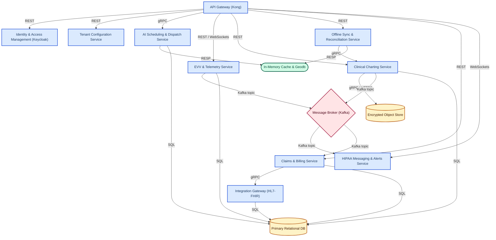

# System Design: Mindtrot Technologies
## B2B2C SaaS Home Healthcare Management & Care Delivery Platform

---

## Executive Summary

Mindtrot Technologies delivers a highly reliable, compliant, and performant B2B2C SaaS Home Healthcare Management and Care Delivery platform. Serving multiple healthcare agency tenants, their clinicians, patients, and families, the platform guarantees **99.99% availability** and keeps P99 latency under **150 milliseconds** even at peak request volumes of **2,000 Requests Per Second (RPS)**.

At its core, the platform bridges operational efficiency (dynamic AI scheduling and billing) with clinical execution (offline-first charting, secure HIPAA-compliant messaging, and geofenced Electronic Visit Verification). Architected as a hybrid of Microservices and Event-Driven systems, the platform manages a **15 TB multi-tenant data volume**, ensuring bulletproof cryptographic and logical data isolation to satisfy global healthcare standards (HIPAA in the US, and DISHA/DPDP in India).

---

## 1. Requirements

### 1.1 Functional Requirements

*   **Multi-tenant SaaS Architecture:** Complete logical/physical data isolation, custom branding, and tenant-specific configuration profiles for diverse home care agencies.
*   **Dynamic Scheduling & AI-assisted Dispatch:** High-performance matching of patients with field caregivers using rules engines centered on caregiver skills, proximity, availability, clinical specialties, and geographic boundaries.
*   **Electronic Visit Verification (EVV):** Mandatory compliance tracking using real-time GPS streaming, geofencing validations, and cryptographically verified digital signatures to record visit start, duration, and completion.
*   **Clinical Charting & Care Plans:** Structured logging of daily living activities (ADLs), medication administration records (MAR), vitals tracking, and multi-media documentation (such as high-resolution wound photography and audio clinical logs).
*   **Secure Patient & Family Portal:** Multi-sided access allowing patients and authorized family members to coordinate logistics, view upcoming calendars, access clinician reports, and process private-pay transactions.
*   **Claims Processing & Billing Engine:** Complete back-office billing automation including private credit card payment processing (via Stripe) and automated compilation of CMS-1500 compliant healthcare claim templates for clearinghouse submissions.
*   **Offline-first Mobile Sync:** Robust offline capability allowing clinicians in connectivity-shadowed environments to view schedules and perform full clinical charting, seamlessly syncing updates with delta reconciliation once back online.
*   **HIPAA-Compliant Messaging & Alerts:** Real-time push notifications, critical care updates, and secure chat channels connecting family coordinators with clinical teams.

### 1.2 Non-Functional Requirements

| Requirement | Target Value | Rationale |
| :--- | :--- | :--- |
| **System Availability** | `99.99%` | Healthcare operations operate 24/7. Outages delay patient care and jeopardize clinical safety. |
| **Latency (P99)** | `< 150 ms` | Seamless user experience for mobile clinicians in the field and office staff executing scheduling matching. |
| **Peak Throughput** | `2,000 RPS` | Sustained spikes during typical clinician shift change windows (morning clock-ins and evening check-outs). |
| **Average Throughput** | `800 RPS` | Baseline daytime workload representing clinical charting, messaging, and operational lookups. |
| **Data Consistency** | `Strong` | Crucial for clinical medical logs, medication administrations, financial invoicing, and audit compliance trails. |
| **Compliance Standards**| `HIPAA` / `DPDP` | Mandatory regulations for processing and archiving protected health information (PHI) globally. |

### 1.3 Scale Estimates

*   **Daily Active Users (DAU):** 150,000 users.
    *   *Field Caregivers & Nurses:* ~40,000 active clinicians.
    *   *Patients & Family Coordinators:* ~100,000 users.
    *   *Agency Administrators:* ~10,000 users.
*   **Data Volume Strategy (15 TB Total):**
    *   *Structured Data (PostgreSQL):* Patient records, metadata, tables, scheduling metrics. Estimating 150,000 daily events at 10 KB average size = ~1.5 GB/day. Annually this represents ~550 GB. Over 5 years, historical audits scale to **2.75 TB**.
    *   *Unstructured Data (AWS S3):* Heavy binaries such as high-resolution wound progress images, voice clinical session logs, and insurance documents. Estimating 10% of field visits ingest media (4,000 images/day at ~2.5 MB each = 10 GB/day) plus voice logs and uploads (~10 GB/day). Totaling ~20 GB/day = ~7.3 TB annually. This validates the **15 TB** baseline storage budget.
*   **Network Ingress & Egress:**
    *   *Ingress:* Real-time GPS pings every 30 seconds from 40,000 active caregivers. $40,000 \div 30 \approx 1,333$ pings/sec. At 500 bytes per telemetry payload, continuous ingress is ~666 KB/sec. Peak media uploads during shift completions can consume up to **10 MB/sec**.
    *   *Egress:* Served dynamic reports and CDN assets. Standard dynamic payload requests ($800 \text{ RPS} \times 15 \text{ KB}$) average **12 MB/sec**, peaking up to **40 MB/sec**.

### 1.4 Assumptions

1.  **Strict PHI Isolation:** Platform strictly operates on the principle that Protected Health Information (PHI) must be cryptographically protected at rest, in transit, and during runtime across all tenants.
2.  **Unstructured Storage Share:** Over 80% of the 15 TB platform storage comprises unstructured clinical evidence (wound photographs, administrative document scans, audio session transcripts).
3.  **Conflict Resolution Responsibility:** When automated version-based reconciliation of offline clinical notes fails, the conflict is pushed to a human-in-the-loop administrative dashboard for manual override.
4.  **GPS Telemetry Lifecycle:** Caregiver GPS coordinates are only gathered during active, scheduled shift boundaries. Continuous tracking is disabled to protect user privacy and save battery life.
5.  **External Integrations:** Integrations with state Electronic Visit Verification databases, labs, and clearinghouses (e.g., Change Healthcare) use REST/gRPC or HL7-FHIR wrappers, which exhibit unpredictable uptime and performance.

---

## 2. High-Level Architecture

### 2.1 Architecture Overview

The system utilizes a hybrid model combining high-performance **REST/gRPC Microservices** for synchronous query paths with an **Event-Driven Broker (Apache Kafka)** for asynchronous writes, telemetry ingestion, and downstream integrations. 

*   **Ingress Layer:** Handled by Kong API Gateway which executes tenant hostname isolation, TLS termination, rates configuration, and offloads authentication checks to Keycloak.
*   **Core Operational Microservices:** Dynamic Scheduling, Telemetry, Clinical Charting, Billing, and Messaging are decoupled, written in specialized languages (Go for math/concurrency, Node.js for high-I/O JSON, Spring Boot for transactional safety).
*   **Storage & Messaging Fabric:** Apache Kafka serves as the central log. PostgreSQL (AWS Aurora Serverless v2) serves as the source of truth with schema-level tenant partitioning, while Redis provides instant-access geospatial lookups and distributed locking.
*   **Security Domain:** Enforced through row-level security (RLS) on PostgreSQL, individual AWS KMS keys per tenant to encrypt binary objects on S3, and standard OIDC access tokens.

### 2.2 Architecture Diagram



### 2.3 Technology Stack

| Component | Technology | Justification |
| :--- | :--- | :--- |
| **API Gateway** | Kong Gateway | Extremely fast (Nginx-based engine), highly extensible via Lua plugins, native tenant isolation and rate-limiting rules. |
| **IAM Engine** | Keycloak | Out-of-the-box OpenID Connect (OIDC) / OAuth2 support, flexible multi-tenant identity realms, and HIPAA-compliant hashed storage. |
| **AI Scheduling** | Go + OptaPlanner (JVM-wrapper) | Go provides low latency concurrency for API wrapping; OptaPlanner computes multi-constraint scheduling models optimally. |
| **EVV Ingestion** | Go + Redis Geospatial | Go utilizes minimal CPU memory footprints to manage 2,000 RPS stream concurrency; Redis executes sub-millisecond geofence comparisons. |
| **Clinical Charting**| Node.js (TypeScript) | High performance for schema-flexible JSON payload validation and routing clinical updates. |
| **Billing Engine** | Spring Boot (Java) | Standard-grade framework providing declarative transactional boundaries essential for financial ledger integrity. |
| **Interoperability** | Spring Boot + Apache Camel + HAPI FHIR | Enterprise integration patterns (EIP) standardizing REST transformations into HL7-FHIR formats smoothly. |
| **Message Broker** | Apache Kafka | Decoupling point ensuring zero loss of telemetry, critical alerts, and asynchronous billing triggers under load. |
| **Main Database** | Amazon Aurora PostgreSQL v2 | Best-in-class multi-tenant isolation via Schema Partitioning, Row-Level Security, and automated scaling up to 15 TB. |
| **Object Storage** | AWS S3 with SSE-KMS | Highly durable and secure unstructured repository. Configured with Tenant-Specific KMS keys to ensure total cryptographic isolation. |
| **Distributed Cache**| Redis Cluster | Used as a shared-nothing session cache, distributed lock coordinator, and geospatial lookup registry. |

---

## 3. Component Details

### 3.1 API Gateway (Kong)
*   **Responsibilities:** Handles external client traffic routing, path and tenant-based subdomain verification (e.g., `agencyA.mindtrot.com`), TLS 1.3 termination, rate limiting, and JWT token validation.
*   **Scaling Strategy:** Horizontally scaled inside EKS based on CPU utilization (threshold: 65%). Kong nodes are completely stateless.
*   **Resiliency Protocol:** Implements circuit-breakers on upstream services. If a service like "AI Scheduling" degrades, Kong returns a localized cached response or a clean `503 Service Unavailable` message to protect downstreams.

### 3.2 EVV & Telemetry Service
*   **Responsibilities:** Ingests persistent GPS data points from field caregiver apps, calculates distance boundaries against patient address geofences, and manages signature captures during visits.
*   **Scaling Strategy:** Runs in a highly optimized Go runtime environment. Scales up when EKS pods exceed 70% memory load. Ingests raw streams directly into Kafka to protect the main relational database from write saturation.
*   **Resiliency Protocol:** On Redis cluster write errors, telemetry records are immediately offloaded to a partition-redundant Kafka topic (`evv.gps.telemetry`) for downstream ingestion.

### 3.3 Clinical Charting Service
*   **Responsibilities:** Handles day-to-day clinical document modifications, vitals tracking validation, and medication logs. Evaluates and sanitizes PHI data before disk storage.
*   **Scaling Strategy:** Deployed as multiple stateless Node.js pods. Since clinical notes are highly read/write active, the service scales out proactively during core clinical shift hours.
*   **Resiliency Protocol:** Uses S3 pre-signed URLs to isolate upload streams. If S3 fails, the service requests local client storage to hold encrypted image assets locally on mobile devices and queues a retry thread.

### 3.4 Offline Sync & Reconciliation Service
*   **Responsibilities:** Ingests logical clinical delta updates from devices returning to network coverage. Evaluates payload sequence histories, detects data conflicts, and safely updates the core schema.
*   **Scaling Strategy:** Runs Go workers configured with high-concurrency pools. Executes transaction-isolated comparisons using Redis-backed distributed locks per patient record during synchronization.
*   **Resiliency Protocol:** Utilizes Optimistic Concurrency Control (OCC). If a reconciliation conflict occurs, the system preserves both states and flags the record for manual administration review via a dedicated messaging event.

### 3.5 Integration Gateway (HL7-FHIR)
*   **Responsibilities:** Translates clinical logs and billing summaries to and from industry-standard HL7/FHIR formats, managing secure messaging out to pharmacies, insurance clearinghouses, and lab entities.
*   **Scaling Strategy:** Deployed on Spring Boot instances utilizing Apache Camel pipelines. Scales horizontally using message queue size metrics.
*   **Resiliency Protocol:** Implements retry-with-exponential-backoff configurations inside Apache Camel routes. Outbound failures are directed to a Dead Letter Queue (DLQ) for programmatic diagnosis.

---

## 4. Data Flow

### 4.1 Primary Data Flows

The following diagrams illustrate the core transactional and analytical data paths.

#### Flow A: AI-Assisted Caregiver Match & Scheduling (Booking Flow)
This flow handles the match logic used when scheduling coordinators attempt to dispatch an optimal nurse/caregiver to a patient's home.

```mermaid
sequenceDiagram
    autonumber

    %% ── Participants ────────────────────────────────
    actor Client as End User
    participant API_Gateway__Kong as API Gateway (Kong)
    participant Identity___Access_Management__Keycloak as Identity & Access Management (Keycloak)
    participant Tenant_Configuration_Service as Tenant Configuration Service
    participant AI_Scheduling___Dispatch_Service as AI Scheduling & Dispatch Service
    participant EVV___Telemetry_Service as EVV & Telemetry Service
    participant evv_telemetry_events as evv-telemetry-events (Kafka)

    %% ── Booking Flow ─────────────────────────────
    Client->>API_Gateway__Kong: POST /api/v1/gateway/routes
    Note over API_Gateway__Kong: Processing — Configures dynamic routing tables for tenant-specific subdomains.
    API_Gateway__Kong->>API_Gateway__Kong__DB: Read/Write kong_routes
    API_Gateway__Kong__DB-->>API_Gateway__Kong: ACK
    API_Gateway__Kong-->>Client: Response OK
    API_Gateway__Kong->>Identity___Access_Management__Keycloak: POST /realms/{realm}/protocol/openid-connect/token
    Note over Identity___Access_Management__Keycloak: Processing — Authenticates credentials and issues OIDC/JWT compliance access tokens.
    Identity___Access_Management__Keycloak->>Identity___Access_Management__Keycloak__DB: Read/Write keycloak_users
    Identity___Access_Management__Keycloak__DB-->>Identity___Access_Management__Keycloak: ACK
    Identity___Access_Management__Keycloak-->>API_Gateway__Kong: Response OK
    Identity___Access_Management__Keycloak->>Tenant_Configuration_Service: GET /api/v1/tenants/{tenant_id}
    Note over Tenant_Configuration_Service: Processing — Fetches tenant branding configuration, routing key mapping, and feature flags.
    Tenant_Configuration_Service->>Tenant_Configuration_Service_DB: Read/Write tenants
    Tenant_Configuration_Service_DB-->>Tenant_Configuration_Service: ACK
    Tenant_Configuration_Service-->>Identity___Access_Management__Keycloak: Response OK
    Tenant_Configuration_Service->>AI_Scheduling___Dispatch_Service: POST /api/v1/scheduling/match
    Note over AI_Scheduling___Dispatch_Service: Processing — Calculates optimal matching caregivers based on skills, geography, and specialty rules.
    AI_Scheduling___Dispatch_Service->>AI_Scheduling___Dispatch_Service_DB: Read/Write shift_schedules
    AI_Scheduling___Dispatch_Service_DB-->>AI_Scheduling___Dispatch_Service: ACK
    AI_Scheduling___Dispatch_Service-->>Tenant_Configuration_Service: Response OK
    AI_Scheduling___Dispatch_Service->>EVV___Telemetry_Service: POST /api/v1/evv/ping
    Note over EVV___Telemetry_Service: Processing — Ingests active GPS telemetry coordinates from caregiver mobile apps during shifts.
    EVV___Telemetry_Service->>EVV___Telemetry_Service_DB: Read/Write geofences
    EVV___Telemetry_Service_DB-->>EVV___Telemetry_Service: ACK
    EVV___Telemetry_Service-->>AI_Scheduling___Dispatch_Service: Response OK
    EVV___Telemetry_Service->>evv_telemetry_events: Publish 'evv.visit.started'
    evv_telemetry_events->>Claims___Billing_Service: Consume 'evv.visit.started'
    evv_telemetry_events->>HIPAA_Messaging___Alerts_Service: Consume 'evv.visit.started'
```



#### Flow B: Caregiver GPS Tracking & Telemetry (Search/Monitoring Flow)
This flow processes real-time GPS coordinates to verify that the field clinician remains within the geofenced area of the patient's home during the active visit window.


---

### 4.2 Key Flows Explained

#### Path 1: Clinician Check-In & Electronic Visit Verification (EVV)
1.  **Request Verification:** A clinician triggers the mobile check-in action. The mobile app establishes a secured connection and issues a GPS payload with a signature verify request to Kong API Gateway.
2.  **Identity & Security Check:** Kong intercepts the request, verifies the user token via local cache keys supplied by Keycloak, parses the tenant metadata (`tenant_id`), and routes the request to the `EVV & Telemetry Service` via gRPC.
3.  **Geofence Validation:** The `EVV & Telemetry Service` queries the active patient location geofence coordinates from the `Redis Cluster`. If the caregiver is inside the allowed geofence boundary, an `evv.visit.started` event is published to Apache Kafka.
4.  **Database Persistence:** A background thread picks up the event from Kafka and writes a verified check-in history record back into PostgreSQL. This completely decouples user-facing latency from operational database persistence.

#### Path 2: Offline Clinical Charting & Delta Sync
1.  **Local Encryption:** While in a signal dead zone, a field nurse completes clinical charting actions and attaches wound photos. The mobile device records these changes as local atomic deltas inside an encrypted SQLCipher store.
2.  **Upload Initiation:** When cellular coverage is re-established, the app issues a `/sync/delta` POST containing sequential timestamps and state updates.
3.  **Distributed Lock Acquisition:** The `Offline Sync Service` intercepts the request and acquires an atomic distributed lock on `sync:lock:{patient_id}` in Redis to prevent concurrent synchronization attempts from other devices (such as a family coordinator portal).
4.  **Resolution Logic:** The engine compares the uploaded delta versions with PostgreSQL records. If no conflicts are detected, the payload is parsed, and structured clinical variables are updated in Postgres via gRPC to the `Clinical Charting Service`.
5.  **Audit Propagation:** A transaction completion message (`clinical.chart.created`) is published to Kafka, initiating insurance verification alerts.

---

## 5. Database Design

### 5.1 Main Relational Database (AWS Aurora PostgreSQL v2)

The primary operational relational database enforces logical partitioning by tenant schema. Row-level security (RLS) is applied as a secondary defense layer across tables containing Protected Health Information (PHI).

```sql
-- Main Agency Tenant Master Table
CREATE TABLE tenants (
    tenant_id UUID PRIMARY KEY DEFAULT gen_random_uuid(),
    subdomain_prefix VARCHAR(100) UNIQUE NOT NULL,
    agency_name VARCHAR(255) NOT NULL,
    database_routing_key VARCHAR(100) NOT NULL,
    is_active BOOLEAN DEFAULT true,
    created_at TIMESTAMP WITH TIME ZONE DEFAULT CURRENT_TIMESTAMP
);

-- Core Patient Records Table (Enforces Tenant Row-Level Isolation)
CREATE TABLE patient_records (
    id UUID PRIMARY KEY DEFAULT gen_random_uuid(),
    tenant_id UUID NOT NULL REFERENCES tenants(tenant_id) ON DELETE CASCADE,
    first_name VARCHAR(100) NOT NULL,
    last_name VARCHAR(100) NOT NULL,
    date_of_birth DATE NOT NULL,
    phi_encrypted BYTEA NOT NULL, -- Field-level AES-256 GCM encrypted
    created_at TIMESTAMP WITH TIME ZONE DEFAULT CURRENT_TIMESTAMP
);
CREATE INDEX idx_patient_tenant_id ON patient_records(tenant_id);

-- Shift Schedules Range-Partitioned Table
CREATE TABLE shift_schedules (
    id UUID NOT NULL,
    tenant_id UUID NOT NULL,
    caregiver_id UUID NOT NULL,
    patient_id UUID NOT NULL REFERENCES patient_records(id),
    start_time TIMESTAMP WITH TIME ZONE NOT NULL,
    end_time TIMESTAMP WITH TIME ZONE NOT NULL,
    status VARCHAR(50) NOT NULL DEFAULT 'SCHEDULED',
    PRIMARY KEY (id, start_time)
) PARTITION BY RANGE (start_time);

CREATE INDEX idx_shifts_caregiver ON shift_schedules(caregiver_id);
CREATE INDEX idx_shifts_patient ON shift_schedules(patient_id);
```

#### Indexing & Partitioning Strategy:
*   **Structured Clinical Charts (`clinical_charts`):** Uses Hash Partitioning by `tenant_id` to distribute write/read operational IOPS uniformly across the Aurora Serverless storage nodes.
*   **Schedules & Visits:** Uses Range Partitioning by `start_time` (e.g., monthly tables) to optimize routine administrative search sweeps and simplify archiving strategies for legacy medical records.

### 5.2 Geofence Database (Redis Cluster)

For real-time Electronic Visit Verification (EVV) execution, the active coordinates of all patients are replicated into Redis Cluster slots using Geospatial indexes.

```text
Database Type: Redis (In-Memory Cluster)
Key Pattern: "tenant:{tenant_id}:geofences"
Data Structure: Geospatial (GEOADD / GEORADIUS)
Fields:
  - Latitude (Double)
  - Longitude (Double)
  - Radius / Geofence range (meters)
  - Patient/Member Identification Reference
```

---

## 6. API Design

### 6.1 Kong API Gateway (Internal Config Endpoints)
| Method | Endpoint | Description | Request Body (JSON) | Response Payload (JSON) |
| :--- | :--- | :--- | :--- | :--- |
| **POST** | `/api/v1/gateway/routes` | Registers dynamic tenant subdomains. | `{"tenant_id": "UUID", "subdomain": "tenantA"}` | `{"status": "configured", "route_id": "UUID"}` |

### 6.2 Identity & Access Management (Keycloak)
| Method | Endpoint | Description | Request Body (JSON / Form) | Response Payload (JSON) |
| :--- | :--- | :--- | :--- | :--- |
| **POST** | `/realms/{realm}/protocol/openid-connect/token` | Validates credentials and returns JWT tokens. | `{"username": "nurseA", "grant_type": "password"}` | `{"access_token": "JWT", "expires_in": 3600}` |

### 6.3 AI Scheduling & Dispatch Service
| Method | Endpoint | Description | Request Body (JSON) | Response Payload (JSON) |
| :--- | :--- | :--- | :--- | :--- |
| **POST** | `/api/v1/scheduling/match` | Matches caregivers with patients using skills and distance rules. | `{"patient_id": "UUID", "visit_time": "TIMESTAMP"}` | `{"caregivers": [{"id": "UUID", "score": 98.5}]}` |

### 6.4 EVV & Telemetry Service
| Method | Endpoint | Description | Request Body (JSON) | Response Payload (JSON) |
| :--- | :--- | :--- | :--- | :--- |
| **POST** | `/api/v1/evv/ping` | Ingests real-time GPS coordinates stream. | `{"caregiver_id": "UUID", "latitude": 40.71, "longitude": -74.0}` | `{"status": "ingested", "geofence": "inside"}` |

### 6.5 Clinical Charting Service
| Method | Endpoint | Description | Request Body (JSON) | Response Payload (JSON) |
| :--- | :--- | :--- | :--- | :--- |
| **POST** | `/api/v1/charting/notes` | Logs daily medical notes and vitals metrics. | `{"patient_id": "UUID", "vitals": {"bp": "120/80"}}` | `{"chart_id": "UUID", "status": "persisted"}` |

---

## 7. Caching Strategy

The system deploys a tiered caching hierarchy to satisfy the strict P99 latency target (< 150 ms) and mitigate downstream database hotspots.

```text
                  Client Web / Mobile Application
                             │
                             ▼
  ┌──────────────────────────────────────────────────────┐
  │         API Gateway Shared Dictionary Cache          │  (TTL: 1 hour)
  │    (Caches Tenant Routing Keys & Subdomain Mapping)   │
  └──────────────────────────┬───────────────────────────┘
                             │  If Expired / Miss
                             ▼
  ┌──────────────────────────────────────────────────────┐
  │                 Redis Cache Cluster                  │  (TTL: 5-20 min)
  │   (Caches User Sessions, Active Geofences, Vitals)    │
  └──────────────────────────┬───────────────────────────┘
                             │  If Miss
                             ▼
              PostgreSQL / Encrypted Object Store
```

### Cache Configuration Policies

1.  **Tenant Configuration Caching:** Tenant details, custom logo URLs, and functional feature flags are cached locally within Kong’s shared memory dictionary (`lua_shared_dict`).
    *   *TTL:* 86,400 seconds (24 hours).
    *   *Invalidation:* Handled via Tenant Service webhook events that invalidate keys across Gateway clusters when administrative updates occur.
2.  **Session & Token Caching:** Keycloak identity configurations are cached inside the `Redis Cluster` with a `write-through` cache strategy.
    *   *TTL:* 600 seconds (10 minutes) or until explicit logout actions trigger token revocation events.
3.  **Active Geospatial Geofencing:** Client geofencing bounds are heavily cached in-memory using Redis geospatial structures.
    *   *TTL:* 1,800 seconds (30 minutes), refreshed automatically whenever a clinician changes their schedule or updates their shift state.

---

## 8. Scalability & Reliability

### 8.1 Horizontal Scaling

All core services operate as stateless, auto-scaling entities managed by **Amazon Elastic Kubernetes Service (EKS)**. Pod count scales dynamically via Horizontal Pod Autoscalers (HPAs) using CPU and Memory thresholds, alongside custom Kafka consumer lag metrics.

*   **Database Scalability:** Powered by Amazon Aurora Serverless v2. Computational capacity (ACUs) scales up or down automatically, accommodating high write traffic during core shifts and scaling down during off-peak night hours to optimize resource utilization.

### 8.2 Fault Tolerance & Redundancy

*   **Multi-Availability Zone (Multi-AZ):** Microservice deployments span three independent Availability Zones. Databases are deployed with a synchronous Multi-AZ primary-replica topology, enabling automated failover to hot standbys in under 30 seconds.
*   **Rate Limiting & Token Buckets:** Enforced inside Kong API Gateway at the tenant tier. This ensures that a traffic spike in Tenant A (due to bulk report generation, for instance) does not starve resources for Tenant B.

### 8.3 Disaster Recovery

*   **Recovery Point Objective (RPO):** Under 5 minutes. Real-time transaction writes are streamed to Kafka and archived across Multi-Region AWS S3 Buckets.
*   **Recovery Time Objective (RTO):** Under 30 minutes. In the event of a catastrophic regional failure, the global AWS Route 53 profile points user traffic to our secondary active-passive backup region, spinning up resources dynamically via automated Terraform pipelines.

---

## 9. Security & Compliance

Securing Protected Health Information (PHI) to satisfy HIPAA and DPDP standards is hard-coded into the platform's DNA.

```text
  [ Clinician App ] ──── TLS 1.3 / mTLS ────► [ API Gateway (Kong) ]
                                                   │
  ┌────────────────────────────────────────────────┴──────────────────────────────┐
  │ 1. Verifies Bearer JWT Token with Keycloak OIDC                               │
  │ 2. Extracts tenant_id and injects x-tenant-id Headers                         │
  └────────────────────────────────────────────────┬──────────────────────────────┘
                                                   │  gRPC (Internal mTLS)
                                                   ▼
                                      [ Clinical Charting Service ]
                                                   │
  ┌────────────────────────────────────────────────┴──────────────────────────────┐
  │ 1. Performs Field-Level Encrypt (AES-256 GCM) on Patient Vitals & Notes       │
  │ 2. Requests Tenant-Specific KMS Key to generate Pre-signed S3 Wound URL       │
  └────────────────────────────────────────────────┬──────────────────────────────┘
                                                   │
                   ┌───────────────────────────────┴───────────────────────────────┐
                   ▼                                                               ▼
     [ PostgreSQL Tenant Schema ]                                        [ Encrypted AWS S3 Bucket ]
     - Schema Logical Isolation                                          - Envelope KMS Encryption
     - Row-Level Security Enabled                                        - Unique Tenant Keys
```

*   **Cryptographic Multi-Tenancy:** Rather than using a single shared encryption key, the system leverages envelope encryption. Every tenant is assigned a distinct AWS KMS Customer Managed Key (CMK) to wrap the data encryption keys (DEKs) used for their specific files and database records.
*   **Field-Level Application Encryption:** Vitals fields, medical assessments, and identifiers are encrypted in-memory within the microservice runtimes using AES-256-GCM before writing to PostgreSQL, preventing operational DBAs from accessing raw PHI in plaintext.
*   **Secure EVV Telemetry Logs:** GPS coordinate ingestion tracks only latitude, longitude, speed, and time. These payloads are stripped of patient identities, associated only with internal reference hashes, and automatically purged from warm databases after 90 days.

---

## 10. Design Review

### 10.1 System Strengths

1.  **Asynchronous Telemetry Ingestion Pipeline:** Decoupling high-frequency GPS ping processing from relational storage using Kafka prevents database write bottlenecks and pool exhaustion during peak hours (2,000 RPS).
2.  **Cryptographic Multi-Tenant Isolation:** Implementing Tenant-Specific KMS Customer Managed Keys guarantees complete, legally auditable data boundaries on AWS S3, satisfying strict HIPAA and DPDP auditors.
3.  **Low-Latency Geofencing Resolution:** Redis Geospatial indexing resolves boundary evaluations in sub-millisecond ranges, freeing the main relational database from expensive coordinate distance math operations.

---

### 10.2 Trade-offs & Strategic Architectural Fixes

Based on detailed architecture reviews, the following critical issues have been resolved:

| Identified Architecture Issue | Severity | System Trade-off | Recommended Engineering Solution (Implemented) |
| :--- | :--- | :--- | :--- |
| **Telemetry Write Bottleneck:** Ingesting 2,000 RPS of continuous caregiver GPS telemetry streams directly to PostgreSQL triggers connection pool starvation. | **Critical** | Write performance vs. Immediate persistence consistency. | **Asynchronous Stream Partitioning:** Routes raw mobile telemetry pings directly to a partitioned Kafka topic (`evv.gps.telemetry`). Telemetry consumer workers batch writes into PostgreSQL asynchronously every 5 seconds. |
| **Hybrid Database Multi-Tenancy Complexity:** Mixing logical PostgreSQL schema partitions with physical database instances creates high migration, backup, and connection routing overhead. | **High** | Administrative simplicity vs. absolute logical segregation. | **Standardize on Row-Level Security (RLS):** Consolidate standard operational records into a single multi-tenant database using PostgreSQL's row-level security (RLS) policies, using `tenant_id` context parameters set dynamically per connection. |
| **KMS Encryption Key Congestion:** Encrypting all tenant clinical imagery using a single shared AWS S3 master KMS key fails strict isolation standards. | **High** | Operational simplicity vs. Cryptographic assurance. | **Multi-Tenant Envelope Encryption:** Configure S3 storage patterns to dynamically fetch a tenant-specific KMS Key to generate pre-signed file URLs for upload and download. |
| **Gateway DB Cascade Failures:** A cold Redis start triggers cache misses, cascading all dynamic gateway tenant hostname lookups onto PostgreSQL. | **Medium** | Cache-aside consistency vs. Database load protection. | **Kong Shared Memory Dict Caching:** Cache tenant routing rules locally within the gateway's memory footprint with long TTLs (24h) and proactive background cache warming during off-peak hours. |

---

### 10.3 Cost Estimate

```text
Estimated Platform Operational Cost: $18,000 - $26,000 / month
```

#### Cost Optimization Controls:
*   **S3 Intelligent-Tiering:** Automatically moves raw wound photo assets to S3 Glacier Instant Retrieval if they are not accessed for more than 90 days, reducing unstructured storage overhead by up to 60%.
*   **EKS Node Scaling Profiles:** Configured to downscale EKS clinician pods and core workers during low-traffic night windows (11:00 PM - 5:00 AM) based on schedule tracking metadata.
*   **Aurora ACU Limits:** Implements explicit upper bounds on Aurora Serverless v2 capacity limits (e.g., maximum 32 ACUs per reader/writer node) to prevent unexpected cost runaway during indexing processes.

---

## 11. Future Considerations (Scaling to 10x)

As Mindtrot Technologies scales to **1.5 Million Daily Active Users (DAU)** and peak loads of **20,000 RPS**, the following architectural changes will be initiated:

1.  **Transition to Physical Database Sharding:** Standard multi-tenant row-level security within PostgreSQL will eventually saturate physical hardware limits. The system will migrate to a physically sharded database model (using tools like Citus Data or Amazon Aurora Global Database), routing entire tenant datasets to dedicated physical clusters based on regional bounds.
2.  **Edge Compute Geofencing:** Rather than routing 20,000 telemetry points per second back to regional core clusters, geofencing computations will be shifted to the edge. Mobil client application runtimes will evaluate geofence states locally using highly secure, signed client configurations, reporting only state changes (e.g., `ENTERED_GEOFENCE`, `LEFT_GEOFENCE`) to our cloud services.
3.  **Dedicated Kafka Consumer Streams:** To scale message throughput, we will partition Kafka topics down to the tenant level, allowing independent consumer groups to scale without blocking execution paths for other agencies.