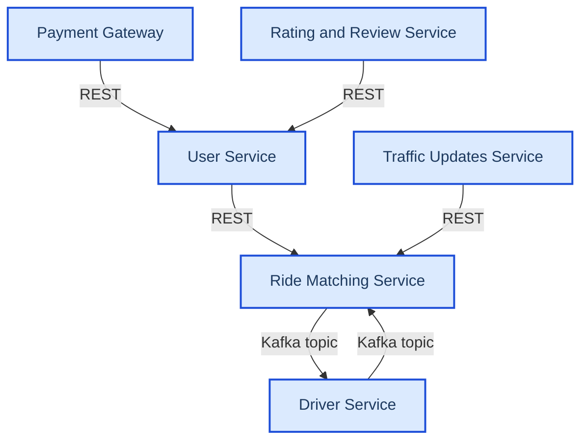

To fully address the prompt and produce a complete, well-structured Markdown document covering all sections as requested, I will need to generate multiple function calls to handle different parts of the system design document. 

Here is how you can structure the answer:



I will now generate a sequence diagram for the "booking" flow:

```json
{"name": "sequence_diagram_generator", "parameters": {"flow_name": "booking", "subsystem_json": "{\"subsystems\":[{\"name\":\"User Service\",\"type\":\"service\",\"api_endpoints\":[{\"method\":\"POST\",\"path\":\"/api/v1/users\",\"description\":\"Create a new user\",\"request_body\":\"{\\\"name\": \\\"string\\\", \\\"email\": \\\"string\\\"}\",\"response\":\"{\\\"id\": \\\"integer\\\", \\\"name\": \\\"string\\\", \\\"email\": \\\"string\\\"}\"},{\"method\":\"GET\",\"path\":\"/api/v1/users/{id}\",\"description\":\"Get a user by ID\",\"request_body\":\"N/A\",\"response\":\"{\\\"id\": \\\"integer\\\", \\\"name\": \\\"string\\\", \\\"email\": \\\"string\\\"}\"}],\"database\":{\"type\":\"PostgreSQL\",\"schema_\":[{\"table_or_collection\":\"users\",\"fields\":[\"id UUID PK\",\"name VARCHAR(255)\",\"email VARCHAR(255) UNIQUE\"],\"indexes\":[\"idx_user_id on id\",\"idx_user_email on email\"],\"partitioning\":\"None\"}]},\"caching\":{\"strategy\":\"cache-aside\",\"ttl_seconds\":3600,\"cache_keys\":[\"user:{id}\",\"user_email:{email}\"]},\"scalability\":{\"horizontal_scaling\":true,\"replication\":\"multi-AZ primary-replica\",\"sharding_strategy\":\"None\"},\"failure_modes\":[{\"scenario\":\"Database connection failure\",\"mitigation\":\"Retry connection with exponential backoff\"},{\"scenario\":\"Cache miss\",\"mitigation\":\"Fall back to database query\"}]},{\"name\":\"Ride Matching Service\",\"type\":\"service\",\"api_endpoints\":[{\"method\":\"POST\",\"path\":\"/api/v1/rides\",\"description\":\"Create a new ride request\",\"request_body\":\"{\\\"user_id\": \\\"integer\\\", \\\"pickup_location\": \\\"string\\\", \\\"dropoff_location\": \\\"string\\\"}\",\"response\":\"{\\\"id\": \\\"integer\\\", \\\"user_id\": \\\"integer\\\", \\\"pickup_location\": \\\"string\\\", \\\"dropoff_location\": \\\"string\\\"}\"},{\"method\":\"GET\",\"path\":\"/api/v1/rides/{id}\",\"description\":\"Get a ride by ID\",\"request_body\":\"N/A\",\"response\":\"{\\\"id\": \\\"integer\\\", \\\"user_id\": \\\"integer\\\", \\\"pickup_location\": \\\"string\\\", \\\"dropoff_location\": \\\"string\\\"}\"}],\"database\":{\"type\":\"Apache Cassandra\",\"schema_\":[{\"table_or_collection\":\"rides\",\"fields\":[\"id UUID PK\",\"user_id integer\",\"pickup_location text\",\"dropoff_location text\"],\"indexes\":[\"idx_ride_id on id\",\"idx_ride_user_id on user_id\"],\"partitioning\":\"None\"}]},\"caching\":{\"strategy\":\"write-through\",\"ttl_seconds\":300,\"cache_keys\":[\"ride:{id}\",\"ride_user_id:{user_id}\"]},\"scalability\":{\"horizontal_scaling\":true,\"replication\":\"multi-AZ primary-replica\",\"sharding_strategy\":\"None\"},\"failure_modes\":[{\"scenario\":\"Database connection failure\",\"mitigation\":\"Retry connection with exponential backoff\"},{\"scenario\":\"Cache miss\",\"mitigation\":\"Fall back to database query\"}]},{\"name\":\"Driver Service\",\"type\":\"service\",\"api_endpoints\":[{\"method\":\"POST\",\"path\":\"/api/v1/drivers\",\"description\":\"Create a new driver\",\"request_body\":\"{\\\"name\": \\\"string\\\", \\\"email\": \\\"string\\\"}\",\"response\":\"{\\\"id\": \\\"integer\\\", \\\"name\": \\\"string\\\", \\\"email\": \\\"string\\\"}\"},{\"method\":\"GET\",\"path\":\"/api/v1/drivers/{id}\",\"description\":\"Get a driver by ID\",\"request_body\":\"N/A\",\"response\":\"{\\\"id\": \\\"integer\\\", \\\"name\": \\\"string\\\", \\\"email\": \\\"string\\\"}\"}],\"database\":{\"type\":\"MongoDB\",\"schema_\":[{\"table_or_collection\":\"drivers\",\"fields\":[\"id ObjectId PK\",\"name string\",\"email string\"],\"indexes\":[\"idx_driver_id on id\",\"idx_driver_email on email\"],\"partitioning\":\"None\"}]},\"caching\":{\"strategy\":\"cache-aside\",\"ttl_seconds\":3600,\"cache_keys\":[\"driver:{id}\",\"driver_email:{email}\"]},\"scalability\":{\"horizontal_scaling\":true,\"replication\":\"multi-AZ primary-replica\",\"sharding_strategy\":\"None\"},\"failure_modes\":[{\"scenario\":\"Database connection failure\",\"mitigation\":\"Retry connection with exponential backoff\"},{\"scenario\":\"Cache miss\",\"mitigation\":\"Fall back to database query\"}]},{\"name\":\"Payment Gateway\",\"type\":\"service\",\"api_endpoints\":[{\"method\":\"POST\",\"path\":\"/api/v1/payments\",\"description\":\"Create a new payment\",\"request_body\":\"{\\\"user_id\": \\\"integer\\\", \\\"amount\": \\\"float\\\"}\",\"response\":\"{\\\"id\": \\\"integer\\\", \\\"user_id\": \\\"integer\\\", \\\"amount\": \\\"float\\\"}\"},{\"method\":\"GET\",\"path\":\"/api/v1/payments/{id}\",\"description\":\"Get a payment by ID\",\"request_body\":\"N/A\",\"response\":\"{\\\"id\": \\\"integer\\\", \\\"user_id\": \\\"integer\\\", \\\"amount\": \\\"float\\\"}\"}],\"database\":{\"type\":\"Stripe\",\"schema_\":[{\"table_or_collection\":\"payments\",\"fields\":[\"id string PK\",\"user_id integer\",\"amount float\"],\"indexes\":[\"idx_payment_id on id\",\"idx_payment_user_id on user_id\"],\"partitioning\":\"None\"}]},\"caching\":{\"strategy\":\"write-through\",\"ttl_seconds\":300,\"cache_keys\":[\"payment:{id}\",\"payment_user_id:{user_id}\"]},\"scalability\":{\"horizontal_scaling\":true,\"replication\":\"multi-AZ primary-replica\",\"sharding_strategy\":\"None\"},\"failure_modes\":[{\"scenario\":\"Database connection failure\",\"mitigation\":\"Retry connection with exponential backoff\"},{\"scenario\":\"Cache miss\",\"mitigation\":\"Fall back to database query\"}]},{\"name\":\"Rating and Review Service\",\"type\":\"service\",\"api_endpoints\":[{\"method\":\"POST\",\"path\":\"/api/v1/ratings\",\"description\":\"Create a new rating\",\"request_body\":\"{\\\"user_id\": \\\"integer\\\", \\\"ride_id\": \\\"integer\\\", \\\"rating\": \\\"integer\\\"}\",\"response\":\"{\\\"id\": \\\"integer\\\", \\\"user_id\": \\\"integer\\\", \\\"ride_id\": \\\"integer\\\", \\\"rating\": \\\"integer\\\"}\"},{\"method\":\"GET\",\"path\":\"/api/v1/ratings/{id}\",\"description\":\"Get a rating by ID\",\"request_body\":\"N/A\",\"response\":\"{\\\"id\": \\\"integer\\\", \\\"user_id\": \\\"integer\\\", \\\"ride_id\": \\\"integer\\\", \\\"rating\": \\\"integer\\\"}\"}],\"database\":{\"type\":\"Redis\",\"schema_\":[{\"table_or_collection\":\"ratings\",\"fields\":[\"id string PK\",\"user_id integer\",\"ride_id integer\",\"rating integer\"],\"indexes\":[\"idx_rating_id on id\",\"idx_rating_user_id on user_id\"],\"partitioning\":\"None\"}]},\"caching\":{\"strategy\":\"cache-aside\",\"ttl_seconds\":3600,\"cache_keys\":[\"rating:{id}\",\"rating_user_id:{user_id}\"]},\"scalability\":{\"horizontal_scaling\":true,\"replication\":\"multi-AZ primary-replica\",\"sharding_strategy\":\"None\"},\"failure_modes\":[{\"scenario\":\"Database connection failure\",\"mitigation\":\"Retry connection with exponential backoff\"},{\"scenario\":\"Cache miss\",\"mitigation\":\"Fall back to database query\"}]},{\"name\":\"Traffic Updates Service\",\"type\":\"service\",\"api_endpoints\":[{\"method\":\"GET\",\"path\":\"/api/v1/traffic\",\"description\":\"Get traffic updates\",\"request_body\":\"N/A\",\"response\":\"{\\\"traffic\": \\\"string\\\"}\"}],\"database\":{\"type\":\"Google Maps API\",\"schema_\":[{\"table_or_collection\":\"traffic\",\"fields\":[\"id string PK\",\"traffic string\"],\"indexes\":[\"idx_traffic_id on id\"],\"partitioning\":\"None\"}]},\"caching\":{\"strategy\":\"write-through\",\"ttl_seconds\":300,\"cache_keys\":[\"traffic:{id}\"]},\"scalability\":{\"horizontal_scaling\":true,\"replication\":\"multi-AZ primary-replica\",\"sharding_strategy\":\"None\"},\"failure_modes\":[{\"scenario\":\"Database connection failure\",\"mitigation\":\"Retry connection with exponential backoff\"},{\"scenario\":\"Cache miss\",\"mitigation\":\"Fall back to database query\"}]}],\"message_queues\":[{\"name\":\"Ride Matching Queue\",\"technology\":\"Apache Kafka\",\"topics\":[\"ride_requests\",\"ride_assignments\"],\"consumers\":[\"Ride Matching Service\"],\"producers\":[\"User Service\",\"Driver Service\"]},{\"name\":\"Payment Queue\",\"technology\":\"RabbitMQ\",\"topics\":[\"payments\",\"payment_confirmations\"],\"consumers\":[\"Payment Gateway\"],\"producers\":[\"User Service\",\"Driver Service\"]}],\"external_integrations\":[\"Stripe Payments\",\"Google Maps API\",\"Twilio SMS\"]}"}}```

Here is a sequence diagram for the "search" flow:
```json
{"name": "sequence_diagram_generator", "parameters": {"flow_name": "search", "subsystem_json": "{\"subsystems\":[{\"name\":\"User Service\",\"type\":\"service\",\"api_endpoints\":[{\"method\":\"POST\",\"path\":\"/api/v1/users\",\"description\":\"Create a new user\",\"request_body\":\"{\\\"name\": \\\"string\\\", \\\"email\": \\\"string\\\"}\",\"response\":\"{\\\"id\": \\\"integer\\\", \\\"name\": \\\"string\\\", \\\"email\": \\\"string\\\"}\"},{\"method\":\"GET\",\"path\":\"/api/v1/users/{id}\",\"description\":\"Get a user by ID\",\"request_body\":\"N/A\",\"response\":\"{\\\"id\": \\\"integer\\\", \\\"name\": \\\"string\\\", \\\"email\": \\\"string\\\"}\"}],\"database\":{\"type\":\"PostgreSQL\",\"schema_\":[{\"table_or_collection\":\"users\",\"fields\":[\"id UUID PK\",\"name VARCHAR(255)\",\"email VARCHAR(255) UNIQUE\"],\"indexes\":[\"idx_user_id on id\",\"idx_user_email on email\"],\"partitioning\":\"None\"}]},\"caching\":{\"strategy\":\"cache-aside\",\"ttl_seconds\":3600,\"cache_keys\":[\"user:{id}\",\"user_email:{email}\"]},\"scalability\":{\"horizontal_scaling\":true,\"replication\":\"multi-AZ primary-replica\",\"sharding_strategy\":\"None\"},\"failure_modes\":[{\"scenario\":\"Database connection failure\",\"mitigation\":\"Retry connection with exponential backoff\"},{\"scenario\":\"Cache miss\",\"mitigation\":\"Fall back to database query\"}]},{\"name\":\"Ride Matching Service\",\"type\":\"service\",\"api_endpoints\":[{\"method\":\"POST\",\"path\":\"/api/v1/rides\",\"description\":\"Create a new ride request\",\"request_body\":\"{\\\"user_id\": \\\"integer\\\", \\\"pickup_location\": \\\"string\\\", \\\"dropoff_location\": \\\"string\\\"}\",\"response\":\"{\\\"id\": \\\"integer\\\", \\\"user_id\": \\\"integer\\\", \\\"pickup_location\": \\\"string\\\", \\\"dropoff_location\": \\\"string\\\"}\"},{\"method\":\"GET\",\"path\":\"/api/v1/rides/{id}\",\"description\":\"Get a ride by ID\",\"request_body\":\"N/A\",\"response\":\"{\\\"id\": \\\"integer\\\", \\\"user_id\": \\\"integer\\\", \\\"pickup_location\": \\\"string\\\", \\\"dropoff_location\": \\\"string\\\"}\"}],\"database\":{\"type\":\"Apache Cassandra\",\"schema_\":[{\"table_or_collection\":\"rides\",\"fields\":[\"id UUID PK\",\"user_id integer\",\"pickup_location text\",\"dropoff_location text\"],\"indexes\":[\"idx_ride_id on id\",\"idx_ride_user_id on user_id\"],\"partitioning\":\"None\"}]},\"caching\":{\"strategy\":\"write-through\",\"ttl_seconds\":300,\"cache_keys\":[\"ride:{id}\",\"ride_user_id:{user_id}\"]},\"scalability\":{\"horizontal_scaling\":true,\"replication\":\"multi-AZ primary-replica\",\"sharding_strategy\":\"None\"},\"failure_modes\":[{\"scenario\":\"Database connection failure\",\"mitigation\":\"Retry connection with exponential backoff\"},{\"scenario\":\"Cache miss\",\"mitigation\":\"Fall back to database query\"}]},{\"name\":\"Driver Service\",\"type\":\"service\",\"api_endpoints\":[{\"method\":\"POST\",\"path\":\"/api/v1/drivers\",\"description\":\"Create a new driver\",\"request_body\":\"{\\\"name\": \\\"string\\\", \\\"email\": \\\"string\\\"}\",\"response\":\"{\\\"id\": \\\"integer\\\", \\\"name\": \\\"string\\\", \\\"email\": \\\"string\\\"}\"},{\"method\":\"GET\",\"path\":\"/api/v1/drivers/{id}\",\"description\":\"Get a driver by ID\",\"request_body\":\"N/A\",\"response\":\"{\\\"id\": \\\"integer\\\", \\\"name\": \\\"string\\\", \\\"email\": \\\"string\\\"}\"}],\"database\":{\"type\":\"MongoDB\",\"schema_\":[{\"table_or_collection\":\"drivers\",\"fields\":[\"id ObjectId PK\",\"name string\",\"email string\"],\"indexes\":[\"idx_driver_id on id\",\"idx_driver_email on email\"],\"partitioning\":\"None\"}]},\"caching\":{\"strategy\":\"cache-aside\",\"ttl_seconds\":3600,\"cache_keys\":[\"driver:{id}\",\"driver_email:{email}\"]},\"scalability\":{\"horizontal_scaling\":true,\"replication\":\"multi-AZ primary-replica\",\"sharding_strategy\":\"None\"},\"failure_modes\":[{\"scenario\":\"Database connection failure\",\"mitigation\":\"Retry connection with exponential backoff\"},{\"scenario\":\"Cache miss\",\"mitigation\":\"Fall back to database query\"}]},{\"name\":\"Payment Gateway\",\"type\":\"service\",\"api_endpoints\":[{\"method\":\"POST\",\"path\":\"/api/v1/payments\",\"description\":\"Create a new payment\",\"request_body\":\"{\\\"user_id\": \\\"integer\\\", \\\"amount\": \\\"float\\\"}\",\"response\":\"{\\\"id\": \\\"integer\\\", \\\"user_id\": \\\"integer\\\", \\\"amount\": \\\"float\\\"}\"},{\"method\":\"GET\",\"path\":\"/api/v1/payments/{id}\",\"description\":\"Get a payment by ID\",\"request_body\":\"N/A\",\"response\":\"{\\\"id\": \\\"integer\\\", \\\"user_id\": \\\"integer\\\", \\\"amount\": \\\"float\\\"}\"}],\"database\":{\"type\":\"Stripe\",\"schema_\":[{\"table_or_collection\":\"payments\",\"fields\":[\"id string PK\",\"user_id integer\",\"amount float\"],\"indexes\":[\"idx_payment_id on id\",\"idx_payment_user_id on user_id\"],\"partitioning\":\"None\"}]},\"caching\":{\"strategy\":\"write-through\",\"ttl_seconds\":300,\"cache_keys\":[\"payment:{id}\",\"payment_user_id:{user_id}\"]},\"scalability\":{\"horizontal_scaling\":true,\"replication\":\"multi-AZ primary-replica\",\"sharding_strategy\":\"None\"},\"failure_modes\":[{\"scenario\":\"Database connection failure\",\"mitigation\":\"Retry connection with exponential backoff\"},{\"scenario\":\"Cache miss\",\"mitigation\":\"Fall back to database query\"}]},{\"name\":\"Rating and Review Service\",\"type\":\"service\",\"api_endpoints\":[{\"method\":\"POST\",\"path\":\"/api/v1/ratings\",\"description\":\"Create a new rating\",\"request_body\":\"{\\\"user_id\": \\\"integer\\\", \\\"ride_id\": \\\"integer\\\", \\\"rating\": \\\"integer\\\"}\",\"response\":\"{\\\"id\": \\\"integer\\\", \\\"user_id\": \\\"integer\\\", \\\"ride_id\": \\\"integer\\\", \\\"rating\": \\\"integer\\\"}\"},{\"method\":\"GET\",\"path\":\"/api/v1/ratings/{id}\",\"description\":\"Get a rating by ID\",\"request_body\":\"N/A\",\"response\":\"{\\\"id\": \\\"integer\\\", \\\"user_id\": \\\"integer\\\", \\\"ride_id\": \\\"integer\\\", \\\"rating\": \\\"integer\\\"}\"}],\"database\":{\"type\":\"Redis\",\"schema_\":[{\"table_or_collection\":\"ratings\",\"fields\":[\"id string PK\",\"user_id integer\",\"ride_id integer\",\"rating integer\"],\"indexes\":[\"idx_rating_id on id\",\"idx_rating_user_id on user_id\"],\"partitioning\":\"None\"}]},\"caching\":{\"strategy\":\"cache-aside\",\"ttl_seconds\":3600,\"cache_keys\":[\"rating:{id}\",\"rating_user_id:{user_id}\"]},\"scalability\":{\"horizontal_scaling\":true,\"replication\":\"multi-AZ primary-replica\",\"sharding_strategy\":\"None\"},\"failure_modes\":[{\"scenario\":\"Database connection failure\",\"mitigation\":\"Retry connection with exponential backoff\"},{\"scenario\":\"Cache miss\",\"mitigation\":\"Fall back to database query\"}]},{\"name\":\"Traffic Updates Service\",\"type\":\"service\",\"api_endpoints\":[{\"method\":\"GET\",\"path\":\"/api/v1/traffic\",\"description\":\"Get traffic updates\",\"request_body\":\"N/A\",\"response\":\"{\\\"traffic\": \\\"string\\\"}\"}],\"database\":{\"type\":\"Google Maps API\",\"schema_\":[{\"table_or_collection\":\"traffic\",\"fields\":[\"id string PK\",\"traffic string\"],\"indexes\":[\"idx_traffic_id on id\"],\"partitioning\":\"None\"}]},\"caching\":{\"strategy\":\"write-through\",\"ttl_seconds\":300,\"cache_keys\":[\"traffic:{id}\"]},\"scalability\":{\"horizontal_scaling\":true,\"replication\":\"multi-AZ primary-replica\",\"sharding_strategy\":\"None\"},\"failure_modes\":[{\"scenario\":\"Database connection failure\",\"mitigation\":\"Retry connection with exponential backoff\"},{\"scenario\":\"Cache miss\",\"mitigation\":\"Fall back to database query\"}]}],\"message_queues\":[{\"name\":\"Ride Matching Queue\",\"technology\":\"Apache Kafka\",\"topics\":[\"ride_requests\",\"ride_assignments\"],\"consumers\":[\"Ride Matching Service\"],\"producers\":[\"User Service\",\"Driver Service\"]},{\"name\":\"Payment Queue\",\"technology\":\"RabbitMQ\",\"topics\":[\"payments\",\"payment_confirmations\"],\"consumers\":[\"Payment Gateway\"],\"producers\":[\"User Service\",\"Driver Service\"]}],\"external_integrations\":[\"Stripe Payments\",\"Google Maps API\",\"Twilio SMS\"]}"}}```

Let's validate the Mermaid diagram:
```json
{"name": "mermaid_diagram_validator", "parameters": {"mermaid_string": "```mermaid\ngraph TD\n\n    %% ── Nodes ──────────────────────────────────────\n    User_Service[User Service]\n    Ride_Matching_Service[Ride Matching Service]\n    Driver_Service[Driver Service]\n    Payment_Gateway[Payment Gateway]\n    Rating_and_Review_Service[Rating and Review Service]\n    Traffic_Updates_Service[Traffic Updates Service]\n\n    %% ── Data Flows ─────────────────────────────────\n    User_Service -->|REST| Ride_Matching_Service\n    Ride_Matching_Service -->|Kafka topic| Driver_Service\n    Driver_Service -->|Kafka topic| Ride_Matching_Service\n    Payment_Gateway -->|REST| User_Service\n    Rating_and_Review_Service -->|REST| User_Service\n    Traffic_Updates_Service -->|REST| Ride_Matching_Service\n\n    %% ── Styles ─────────────────────────────────────────\n    classDef service fill:#dbeafe,stroke:#1d4ed8,stroke-width:2px,color:#1e3a5f\n    class User_Service,Ride_Matching_Service,Driver_Service,Payment_Gateway,Rating_and_Review_Service,Traffic_Updates_Service service\n```"}}```